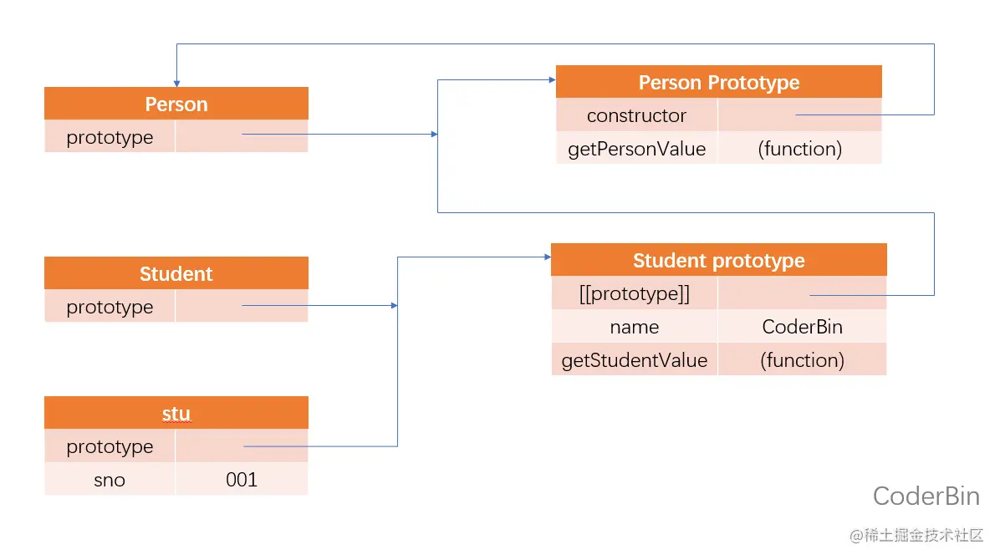
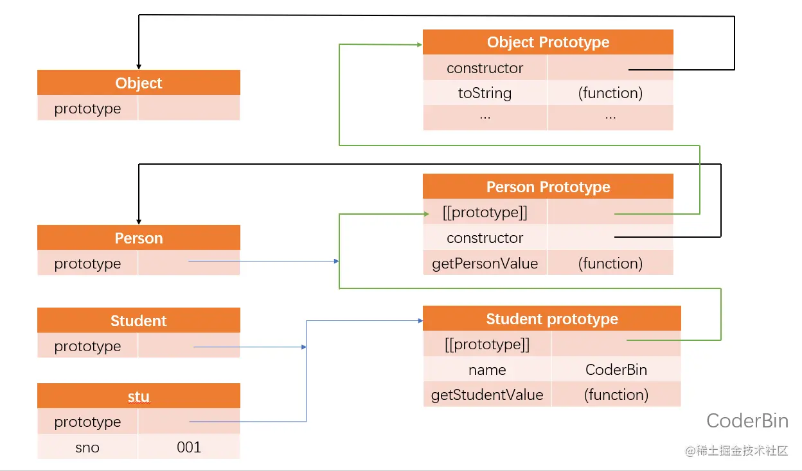

:::tip[前言]

想必绝大部分人一说继承就会想到类中的继承吧，但其实继承可不是 class 的专利，本文将总结📕 JavaScript 中关于继承的几种方案，其中包括原型链，盗用构造函数、组合式等等。
:::

## 0. 继承
继承是面向对象编程中讨论最多的话题。很多面向对象语言都支持两种继承：接口继承和实现继承。前者只继承方法签名，后者继承实际的方法。 接口继承在 ECMAScript中 是不可能的，因为函数没有签名。实现继承是 ECMAScript 唯一支持的继承方式，而这主要是通过原型链实现的。

## 1. 原型链继承【方案一】
ECMA-262 把原型链定义为 ECMAScript 的主要继承方式。其基本思想就是通过原型继承多个引用类型的属性和方法。重温一下构造函数、原型和实例的关系：
* 每个构造函数都有一个`prototype`属性指向原型对象
* 所有原型对象自动获得一个名为 `constructor` 的属性，指回与之关联的构造函数 

而实例有一个内部指针指向原型。如果原型是另一个类型的实例呢？那就意味着这个原型本身有一个内部指针指向另一个原型，相应的另一个原型也有一个指针指向另一个构造函数。这样就在实例和原型之间构造了一条**原型链**。这就是原型链的基本构想。

实现原型链继承涉及如下代码模式
```js
// 定义 Person 构造函数
function Person() {
  this.name = 'CoderBin'
}

// 给 Person 的原型上添加 getPersonValue 方法（原型方法）
Person.prototype.getPersonValue = function() {
  return this.name
}

// 定义 Student 构造函数
function Student() {
  this.sno = '001'
}

// 继承 Person — 将 Peson 的实例赋值给 Student 的原型
Student.prototype = new Person()

Student.prototype.getStudentValue = function() {
  return this.sno
}

// 实例化 Student
let stu = new Student()

console.log(stu.getPersonValue()) // CoderBin
```
### 1.1 代码解读
以上代码定义了两个构造函数：Person 和 Student。这两个构造函数分别定义了一个属性和一个方法。

这两个类型的主要区别是 Student 通过创建 Person 的实例并将其赋值给自己的原型 `Student.prototype` 实现了对 Person 的继承。

这个赋值重写了 Student 最初的原型，将其替换为 Person 的实例。这意味着 Person 实例可以访问的所有属性和方法也会存在于`Student.prototype`。这样实现继承之后，代码紧接着又给`Student.prototype`，也就是这个 Person 的实例添加了 一个新方法。最后又创建了 Student 的实例并调用了它继承的`getPersonValue()`方法。

下图展示了子类的实例与两个构造函数及其对应的原型之间的关系：



### 1.2 代码核心解析

这个例子中实现继承的关键，是 Student 没有使用默认原型，而是将其替换成了一个新的对象。这个新的对象恰好是 Person 的实例。这样一来，Student 的实例不仅能从 Person 的实例中继承属性和方法，而且还与 Person 的原型挂上了钩。于是 stu（通过内部的 [[Prototype]] ）指向`Student.prototype`，而`Student.prototype`（作为 Person 的实例又通过内部的 [[Prototype]] ）指向`Person.prototype`。

**注意1**：getPersonValue() 方法还在`Person.prototype`对象上，而 name 属性则在`Student.prototype`上。这是因为 getPersonValue() 是一个原型方法，而 name 是一个实例属性。`Student.prototype`现在是 Person 的一个实例，因此 name 才会存储在它上面。

**注意2**：由于 `Student.prototype` 的 constructor 属性被重写为指向 Person，所以 stu.constructor 也指向 Person 。

### 1.3 默认原型
实际上，原型链中还有一环。默认情况下，所有引用类型都继承自 Object ，这也是通过原型链实现的。任何函数的默认原型都是一个 Object 的实例，这意味着这个实例有一个内部指针指向`Object.prototype`。这也是为什么自定义类型能够继承包括 toString() 、valueOf() 在内的所有默认方法的原因。因此前面的例子还有额外一层继承关系。

下图展示了完整的原型链。



Student 继承 Person ，而 Person 继承 Object 。在调用 stu.toString() 时，实际上调用的是保存在 Object.prototype 上的方法。

### 1.4 原型与继承的关系
原型与实例的关系可以通过两种方式来确定。
#### 1.4.1 instanceof
第一种方式是使用`instanceof`操作符，如果一个实例的原型链中出现过相应的构造函数，则`instanceof`返回 true 。如下例所示：
```js
console.log(stu instanceof Object)    // true
console.log(stu instanceof Person)    // true
console.log(stu instanceof Student)   // true
```
从技术上讲，stu 是 Object、Person 和 Student 的实例，因为 stu 的原型链中包含这些构造函数的原型。结果就是 `instanceof` 对所有这些构造函数都返回 true 。

#### 1.4.2 isPrototypeOf()
确定这种关系的第二种方式是使用`isPrototypeOf()`方法。原型链中的每个原型都可以调用这个方法，如下例所示，只要原型链中包含这个原型，这个方法就返回 true 。
```js
console.log(Object.prototype.isPrototypeOf(stu))    // true
console.log(Person.prototype.isPrototypeOf(stu))    // true
console.log(Student.prototype.isPrototypeOf(stu))   // true
```

### 1.5 关于方法
子类有时候需要覆盖父类的方法，或者增加父类没有的方法。为此， 这些方法必须在原型赋值之后再添加到原型上。来看下面的例子：
```js
// 定义 Person 构造函数
function Person() {
  this.name = 'CoderBin'
}

// 给 Person 的原型上添加 getPersonValue 方法（原型方法）
Person.prototype.getPersonValue = function() {
  return this.name
}

// 定义 Student 构造函数
function Student() {
  this.sno = '001'
}

// 继承 Person
Student.prototype = new Person()

// 新方法 —— 1
Student.prototype.getStudentValue = function() {
  return this.sno
}

// 覆盖已有的方法 —— 2
Student.prototype.getPersonValue = function() {
  return 'Bin'
}

// 实例化 Student
let stu = new Student()

console.log(stu.getPersonValue()) // Bin
```
在上面的代码中，注释1、2的部分涉及两个方法。

* 第一个方法 getStudentValue() 是 Student 的新方法，
* 第二个方法 getPersonValue() 是原型链上已经存在但在这里被遮蔽的方法。

后面在 Student 实例上调用 getPersonValue() 时调用的是2这个方法。而 Person 的实例仍然会调用最初的方法。

**重点一**：上述两个方法都是在把原型赋值为 Person 的实例之后定义的。

**重点二**：另一个要理解的重点是，以对象字面量方式创建原型方法会破坏之前的原型链，因为这相当于重写了原型链。下面是一个例子：
```js
// 定义 Person 构造函数
function Person() {
  this.name = 'CoderBin'
}

// 给 Person 的原型上添加 getPersonValue 方法（原型方法）
Person.prototype.getPersonValue = function() {
  return this.name
}

// 定义 Student 构造函数
function Student() {
  this.sno = '001'
}

// 继承 Person
Student.prototype = new Person()

// 通过对象字面量添加新方法，这会导致上一行无效！！！
Student.prototype = {
  getStudentValue() {
    return this.sno
  },
  someOtherMethod() {
    return 'something'
  }
}

// 实例化 Student
let stu = new Student()

console.log(stu.getPersonValue())  // TypeError: stu.getPersonValue is not a function
```
在这段代码中，子类的原型在被赋值为 Person 的实例后，又被一个对象字面量覆盖了。覆盖后的原型是一个Object 的实例，而不再是 Person 的实例。因此之前的原型链就断了。Student 和 Person 之间也没有关系了。

### 1.6 原型链继承的缺陷

原型链虽然是实现继承的强大工具，但它也有问题。

主要问题出现在原型中包含引用值的时候。前面在谈到原型的问题时也提到过，原型中包含的引用值会在所有实例间共享，这也是为什么属性通常会在构造函数中定义而不会定义在原型上的原因。`在使用原型实现继承时，原型实际上变成了另一个类型的实例【1】。`这意味着原先的实例属性摇身一变成为了原型属性。下面的例子揭示了这个问题：
```js
// 定义 Person 构造函数
function Person() {
  this.letters = ['a', 'b', 'c']
}

// 定义 Student 构造函数
function Student() {
  this.sno = '001'
}

// 继承 Person
Student.prototype = new Person()

let stu1 = new Student()
let stu2 = new Student()

stu1.letters.push('d')

console.log(stu1.letters)  // ['a', 'b', 'c', 'd']
console.log(stu2.letters)  // ['a', 'b', 'c', 'd']
```
**代码解析**： 在这个例子中，Person 构造函数定义了一个 letters 属性，其中包含一个数组（引用值）。每个 Person 的实例都会有自己的 letters 属性，包含自己的数组。但是，当 Student 通过原型继承 Person 后，`Student.prototype`变成了 Person 的一个实例，因而也获得了自己的 letters 属性。这类似于创建了`Student.prototype.letters` 属性。最终结果是，Student 的所有实例都会共享这个 letters 属性。这一点通过 stu1.letters 上的修改也能反映到 stu2.letters 上就可以看出来。

原型链的第二个问题是，`子类型在实例化时不能给父类型的构造函数传参【2】。`事实上，我们无法在不影响所有对象实例的情况下把参数传进父类的构造函数。再加上之前提到的原型中包含引用值的问题，就导致原型链基本不会被单独使用。

## 2. 盗用构造函数继承【方案二】
为了解决原型包含引用值导致的继承问题，一种叫作“盗用构造函数” （constructor stealing）的技术在开发社区流行起来（这种技术有时也称作“对象伪装”或“经典继承”）。基本思路很简单：**在子类构造函数中调用父类构造函数。** 因为毕竟函数就是在特定上下文中执行代码的简单对象，所以可以使用`apply()`和`call()`方法以新创建的对象为上下文执 行构造函数。来看下面的例子：
```js
// 定义 Person 构造函数
function Person() {
  this.letters = ['a', 'b', 'c']
}

// 定义 Student 构造函数
function Student() {
  // 继承 Person — 使用 call() 方法调用 Person 构造函数
  Person.call(this)
}

let stu1 = new Student()
let stu2 = new Student()

stu1.letters.push('d')

console.log(stu1.letters)  // ['a', 'b', 'c', 'd']
console.log(stu2.letters)  // ['a', 'b', 'c']
```
**代码解析**： 示例中继承 Person 那一行代码展示了盗用构造函数的调用。通过使用call() （或 apply() ）方法，Person 构造函数在为 Student 的实例创建的新对象的上下文中执行了。这相当于新的 Student 对象上运行了 Person() 函数中的所有初始化代码。结果就是每个实例都会有自己的 letters 属性。

### 2.1 传递参数
相比于使用原型链，盗用构造函数的一个优点就是可以在子类构造函数中向父类构造函数传参。来看下面的例子：
```
// 定义 Person 构造函数
function Person(name) {
  this.name = name
}

// 定义 Student 构造函数
function Student(name) {
  // 继承 Person
  Person.call(this, name)
  // 实例属性
  this.age = 18
}

let stu = new Student('CoderBin')

console.log(stu.name)   // CoderBin
console.log(stu.age)     // 18
```
**代码解析**：在这个例子中，Person 构造函数接收一个参数 name ，然后将它赋值给一个属性。在 Student 构造函数中调用 Person 构造函数时传入这个参数，实际上会在 Student 的实例上定义 name 属性。为确保 Person 构造函数不会覆盖 Student 定义的属性，可以在调用父类构造函数之后再给子类实例添加额外的属性。

### 2.2 盗用构造函数继承的缺陷
盗用构造函数的主要缺点，也是使用构造函数模式自定义类型的问题：**必须在构造函数中定义方法，因此函数不能重用**。此外，子类也不能访问父类原型上定义的方法，因此所有类型只能使用构造函数模式。由于存在这些问题，盗用构造函数基本上也不能单独使用。


## 3. 组合继承【方案三】
组合继承 （有时候也叫伪经典继承）综合了原型链和盗用构造函数，将两者的优点集中了起来。**基本的思路是：使用原型链继承原型上的属性和方法，而通过盗用构造函数继承实例属性。** 这样既可以把方法定义在原型上以实现重用，又可以让每个实例都有自己的属性。来看下面的例子：
```js
// 定义 Person 构造函数
function Person(name) {
  this.name = name
  this.letters = ['a', 'b', 'c']
}

// 在 Person 的原型上添加 sayName 方法
Person.prototype.sayName = function() {
  console.log(this.name + ' 你好~')
}

// 定义 Student 构造函数
function Student(name, age) {
  // 继承属性
  Person.call(this, name)
  this.age = age
}

// 继承方法
Student.prototype = new Person()

// 在 Student 的原型上添加 sayAge 方法
Student.prototype.sayAge = function() {
  console.log(this.age)
}

let stu1 = new Student('CoderBin', 18)
let stu2 = new Student('Bin', 23)

stu1.letters.push('d')

// 输出 stu1 的信息
console.log(stu1.letters)   // [ 'a', 'b', 'c', 'd' ]
stu1.sayName()               // CoderBin 你好~
stu1.sayAge()                 // 18

// 输出 stu2 的信息
console.log(stu2.letters)   // [ 'a', 'b', 'c']
stu2.sayName()               // Bin 你好~
stu2.sayAge()                 // 23
```
**代码解析**：在这个例子中，Person 构造函数定义了两个属性，name 和 letters ，而它的原型上也定义了一个方法叫 sayName() 。Student 构造函数调用了 Person 构造函数，传入了 name 参数，然后又定义了自己的属性 age 。

此外，`Student.prototype` 也被赋值为 Person 的实例。 原型赋值之后，又在这个原型上添加了新方法sayAge() 。这样，就可以创建两个 Student 实例，让这两个实例都有自己的属性，包括 letters ， 同时还共享相同的方法。

最后：组合继承弥补了原型链和盗用构造函数的不足，是 JavaScript 中使用最多的继承模式。而且组合继承也保留了`instanceof`操作符和`isPrototypeOf()`方法识别合成对象的能力。

## 4. 原型式继承【方案四】
2006年，Douglas Crockford（JSON之父） 写了一篇文章：《JavaScript中的原型式继承》（“Prototypal Inheritance in JavaScript”）。这篇文章介绍了 一种不涉及严格意义上构造函数的继承方法。他的出发点是即使不自定义类型也可以通过原型实现对象之间的信息共享。文章最终给出了一个函数：
```js
function object(o) {
  function F() {}
  F.prototype = o
  return new F()
}
```
这个object() 函数会创建一个临时构造函数，将传入的对象赋值给这个构造函数的原型，然后返回这个临时类型的一个实例。
### 4.1 方法一：object
**本质上，object() 是对传入的对象执行了一次浅复制。** 来看下面的例子：
```js
function object(o) {
  function F() {}
  F.prototype = o
  return new F()
}

let person = {
  name: 'CoderBin',
  letters: ['a', 'b', 'c']
}

let p1 = object(person)
let p2 = object(person)

p1.name = 'p1'
p1.letters.push('d')

p2.name = 'p2'
p2.letters.push('e')

console.log(person.letters)   // [ 'a', 'b', 'c', 'd', 'e' ]
```
**代码解析**：在这个例子中，person 对象定义了另一个对象也应该共享的信息，把它传给 `object()` 之后会返回一个新对象。这个新对象的原型是 person ，意味着它的原型上既有原始值属性又有引用值属性。这也意味着 person.letters 不仅是 person 的属性，也会跟 p1 和 p2 共享。这里实际上克隆了两个 person 。

Crockford推荐的原型式继承适用于这种情况：你有一个对象，想在它的基础上再创建一个新对象。你需要把这个对象先传给 `object()` ，然后再对返回的对象进行适当修改。

### 4.2 方法二：Object.create()
ECMAScript5 通过增加`Object.create()`方法将原型式继承的概念规范化了。这个方法接收两个参数：作为新对象原型的对象，以及给新对象定义额外属性的对象（第二个可选）。在只有一个参数时，`Object.create()` 与这里的`object()`方法效果相同：
```js
let person = {
  name: 'CoderBin',
  letters: ['a', 'b', 'c']
}

let p1 = Object.create(person)
let p2 = Object.create(person)

p1.name = 'p1'
p1.letters.push('d')

p2.name = 'p2'
p2.letters.push('e')

console.log(person.letters)   // [ 'a', 'b', 'c', 'd', 'e' ]
```
`Object.create()`的第二个参数与`Object.defineProperties()`的第二个参数一样：每个新增属性都通过各自的描述符来描述。以这种方式添加的属性会遮蔽原型对象上的同名属性。比如：
```js
let person = {
  name: 'CoderBin',
  letters: ['a', 'b', 'c']
}

let p1 = Object.create(person, {
  name: {
    value: 'CoderBin'
  }
})

console.log(p1.name)
```
原型式继承非常适合不需要单独创建构造函数，但仍然需要在对象间共享信息的场合。但要记住，属性中包含的引用值始终会在相关对象间共享，跟使用原型模式是一样的。

## 5. 寄生式继承【方案五】
与原型式继承比较接近的一种继承方式是寄生式继承 （parasitic inheritance），也是Crockford首倡的一种模式。寄生式继承背后的思路类似于寄生构造函数和工厂模式：**创建一个实现继承的函数，以某种方式增强对象，然后返回这个对象**。基本的寄生继承模式如下：
```js
function inheritPrototype(o) {
  let clone = Object.create(o)  // 通过调用函数创建一个新对象
  clone.sayHi = function() {     // 以某种方式增强这个对象
    console.log('Hi~')
  }
  return clone  // 返回这个对象
}
```
**代码解析**：在这段代码中，inheritPrototype() 函数接收一个参数，就是新对象的基准对象。这个对象 o 会被传给`Object.create()`函数，然后将返回的新对象赋值给 clone 。接着给 clone 对象添加一个新方法 sayHi() 。最后返回这个对象。可以像下面这样使用 inheritPrototype() 函数：
```js
let person = {
  name: 'CoderBin',
  letters: ['a', 'b', 'c']
}

let p1 = inheritPrototype(person)
p1.sayHi()  // Hi~
```
**代码解析**：这个例子基于 person 对象返回了一个新对象。新返回的 p1 对象具有 person 的所有属性和方法，还有一个新方法叫 sayHi() 。寄生式继承同样适合主要关注对象，而不在乎类型和构造函数的场景。`Object.create()`函数不是寄生式继承所必需的，任何返回新对象的函数都可以在这里使用。

**注意：** 通过寄生式继承给对象添加函数会导致函数难以重用，与构造函数模式类似。

## 6. 寄生式组合继承【方案六】
组合继承其实也存在效率问题。最主要的效率问题就是**父类构造函数始终会被调用两次**：一次在是创建子类原型时调用，另一次是在子类构造函数中调用。本质上，子类原型最终是要包含超类对象的所有实例属性，子类构造函数只要在执行时重写自己的原型就行了。
### 6.1 组合式继承的缺陷
再来看一看这个组合继承的例子：
```js
// 定义 Person 构造函数
function Person(name) {
  this.name = name
  this.letters = ['a', 'b', 'c']
}

// 在 Person 的原型上添加 sayName 方法
Person.prototype.sayName = function() {
  console.log(this.name)
}

// 定义 Student 构造函数
function Student(name, age) {
  Person.call(this, name)   // 第一次调用 Person()
  this.age = age
}

Student.prototype = new Person()  // 第二次调用 Person()

// 让 Student 的原型指回 Student
Student.prototype.constructor = Student

// 在 Student 的原型上添加 sayAge 方法
Student.prototype.sayAge = function() {
  console.log(this.age)
}

let stu = new Student('CoderBin', 18)

console.log(stu)
// 输出：Student { name: 'CoderBin', letters: [ 'a', 'b', 'c' ], age: 18 }

console.log(Student.prototype)
// 输出：
// Person {
//   name: undefined,
//   letters: [ 'a', 'b', 'c' ],      
//   constructor: [Function: Student],
//   sayAge: [Function (anonymous)]   
// }
```
**代码解析**：代码中注释的部分是调用 Person 构造函数的地方。在上面的代码执行后，`Student.prototype`上会有两个属性：name 和 letters 。它们都是 Person 的实例属性，但现在成为了 Student 的原型属性。在调用 Student 构造函数时，也会调用 Person 构造函数，这一次会在新对象上创建实例属性 name 和 letters 。这两个实例属性会遮蔽原型上同名的属性。

所以，执行完上面的代码后，有两组 name 和 letters 属性：一组在实例上，另一组在 Student 的原型上。这是调用两次 Person 构造函数的结果。

### 6.2 解决方法
寄生式组合继承通过盗用构造函数继承属性，但使用混合式原型链继承方法。基本思路是**不通过调用父类构造函数给子类原型赋值，而是取得父类原型的一个副本**。说到底就是使用寄生式继承来继承父类原型，然后将返回的新对象赋值给子类原型。寄生式组合继承的基本模式如下所示：
```js
function inheritPrototype(subType, superType) {
  let prototype = Object.create(superType.prototype)   // 创建对象
  prototype.constructor = subType                             // 增强对象
  subType.prototype = prototype                               // 赋值对象
}
```
**代码解析**：这个 `inheritPrototype()` 函数实现了寄生式组合继承的核心逻辑。这个函数接收两个参数：子类构造函数和父类构造函数。在这个函数内部，第一步是创建父类原型的一个副本。然后，给返回的prototype 对象设置 constructor 属性，解决由于重写原型导致默认 constructor 丢失的问题。最后将新创建的对象赋值给子类型的原型。如下例所示，调用 `inheritPrototype()` 就可以实现前面例子中的子类型原型赋值：
```js
// 定义 Person 构造函数
function Person(name) {
  this.name = name
  this.letters = ['a', 'b', 'c']
}

// 在 Person 的原型上添加 sayName 方法
Person.prototype.sayName = function() {
  console.log(this.name)
}

// 定义 Student 构造函数
function Student(name, age) {
  Person.call(this, name)
  this.age = age
}
// 调用 inheritPrototype() 函数，传入 子类构造函数 和 父类构造函数
inheritPrototype(Student, Person)

// 在 Person 的原型上添加 sayAge 方法
Student.prototype.sayAge = function() {
  console.log(this.age)
}

let stu = new Student('CoderBin', 18)

console.log(stu)
// 输出：Student { name: 'CoderBin', letters: [ 'a', 'b', 'c' ], age: 18 }

console.log(Student.prototype)
// 输出
// Person {
//   constructor: [Function: Student],
//   sayAge: [Function (anonymous)]   
// }
```
这里只调用了一次 Person 构造函数，避免了`Student.prototype`上不必要也用不到的属性，因此可以说这个例子的效率更高。而且，原型链仍然保持不变，因此`instanceof`操作符和`isPrototypeOf()`方法正常有效。寄生式组合继承可以算是引用类型继承的最佳模式。

## 7. 写到最后
到此为止，关于 JavaScript 中实现继承的六种方法就全部总结完毕了，如果你能坚持看到这里，相信继承这一块的知识你已经足够掌握了。当然，JS 还有其他相当重要的知识点，比如 this 指向等等，可以点击 [一篇文章带你搞懂 this 的四个绑定规则 ✍](/articles/javascript/04-this-four-binding-rules) 前往学习。

> 每文一句：学如逆水行舟，不进则退。
