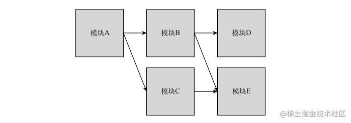
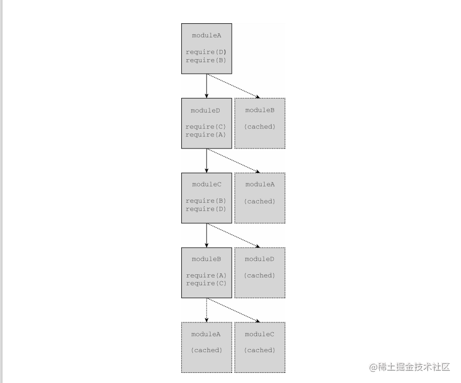
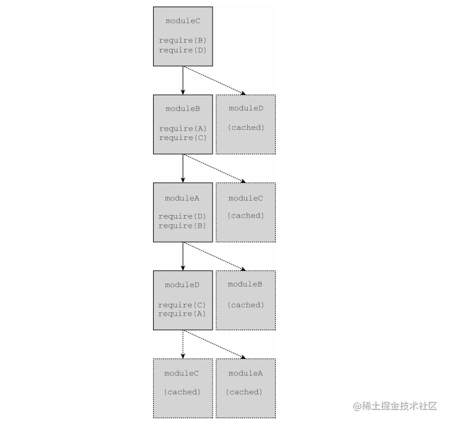

# 前言
现代JavaScript开发毋庸置疑会遇到代码量大和广泛使用第三方库的问题。解决这个问题的方案通常需要把代码拆分成很多部分，然后再通过某种方式将它们连接起来。 

在ECMAScript 6模块规范出现之前，虽然浏览器原生不支持模块的行为， 但也迫切需要这样的行为。ECMAScript同样不支持模块，**因此希望使用模块模式的库或代码库必须基于JavaScript的语法和词法特性“伪造”出类似模块的行为**。

因为JavaScript是异步加载的解释型语言，所以得到广泛应用的各种模块实现也表现出不同的形态。这些不同的形态决定了不同的结果，但最终它们都实现了经典的模块模式。


## 1. 理解模块模式
将代码拆分成独立的块，然后再把这些块连接起来可以通过模块模式来实现。这种模式背后的思想很简单：**把逻辑分块，各自封装，相互独立，每个块自行决定对外暴露什么，同时自行决定引入执行哪些外部代码**。不同的实现和特性让这些基本的概念变得有点复杂，但这个基本的思想是所有 JavaScript 模块系统的基础。

## 2. 模块标识符
**模块标识符是所有模块系统通用的概念**。**模块系统本质上是键/值实体，其中每个模块都有个可用于引用它的标识符**。这个标识符在模拟模块的系统中可能是字符串，在原生实现的模块系统中可能是模块文件的实际路径。

**有的模块系统支持明确声明模块的标识，还有的模块系统会隐式地使用文 件名作为模块标识符**。不管怎样，完善的模块系统一定不会存在模块标识冲突的问题，且系统中的任何模块都应该能够无歧义地引用其他模块。

**将模块标识符解析为实际模块的过程要根据模块系统对标识符的实现**。原生浏览器模块标识符必须提供实际JavaScript文件的路径。除了文件路径，Node.js 还会搜索 `node_modules` 目录，用标识符去匹配包含 index.js 的目录。

## 3. 模块依赖
**模块系统的核心是管理依赖**。指定依赖的模块与周围的环境会达成一种契约。本地模块向模块系统声明一组外部模块（依赖），这些外部模块对于当前模块正常运行是必需的。模块系统检视这些依赖，进而保证这些外部模块能够被加载并在本地模块运行时初始化所有依赖。 

**每个模块都会与某个唯一的标识符关联，该标识符可用于检索模块**。这个标识符通常是JavaScript文件的路径，但在某些模块系统中，这个标识符也可以是在模块本身内部声明的命名空间路径字符串。

## 4. 模块入口
相互依赖的模块必须指定一个模块作为入口（entry point），这也是代码执行的起点。这是理所当然的，**因为JavaScript是顺序执行的，并且是单线程的，所以代码必须有执行的起点**。入口模块也可能依赖其他模块，其他模块同样可能有自己的依赖。于是模块化JavaScript应用程序的所有模块会构成依赖图。

可以通过有向图来表示应用程序中各模块的依赖关系。下图展示了一个想象中应用程序的模块依赖关系图。



图中的箭头表示依赖方向：模块A依赖模块B和模块C，模块B依赖模块D和模块E，模块C依赖模块E。**因为模块必须在依赖加载完成后才能被加载**，所以这个应用程序的入口模块A必须在应用程序的其他部分加载后才能执行。

在JavaScript中，“加载”的概念可以有多种实现方式。因为模块是作为包含将立即执行的JavaScript代码的文件实现的，所以一种可能是按照依赖图的要求依次请求各个脚本。对于前面的应用程序来说，下面的脚本请 求顺序能够满足依赖图的要求：
```html
<script src="moduleE.js"></script>
<script src="moduleD.js"></script>
<script src="moduleC.js"></script>
<script src="moduleB.js"></script>
<script src="moduleA.js"></script>
```
**模块加载是“阻塞的”，这意味着前置操作必须完成才能执行后续操作**。每个模块在自己的代码到达浏览器之后完成加载，此时其依赖已经加载并初始化。不过，这个策略存在一些性能和复杂性问题。为一个应用程序而按顺序加载五个JavaScript文件并不理想，并且手动管理正确的加载顺序也颇为棘手。

## 5. 异步依赖
因为JavaScript可以异步执行，所以如果能按需加载就好了。换句话说， 可以让JavaScript通知模块系统在必要时加载新模块，并在模块加载完成 后提供回调。在代码层面，可以通过下面的伪代码来实现：
```js
// 在模块A里面
load('moduleB').then(function(moduleB) {
  moduleB.doStuff()
})
```

模块A的代码使用了 moduleB 标识符向模块系统请求加载模块B，并以模块B作为参数调用回调。模块B可能已加载完成，也可能必须重新请求和初始化，但这里的代码并不关心。这些事情都交给了模块加载器去负责。

如果重写前面的应用程序，只使用动态模块加载，那么使用一个 `<script>` 标签即可完成模块A的加载。模块A会按需请求模块文件，而不会生成必需 的依赖列表。这样有几个好处，**其中之一就是性能，因为在页面加载时只需同步加载一个文件**。

这些脚本也可以分离出来，比如给 `<script>` 标签应用 defer 或 async 属性，再加上能够识别异步脚本何时加载和初始化的逻辑。此行为将模拟在ES6模块规范中实现的行为。

## 6. 动态依赖
有些模块系统要求开发者在模块开始列出所有依赖，而有些模块系统则允许开发者在程序结构中动态添加依赖。动态添加的依赖有别于模块开头列出的常规依赖，这些依赖必须在模块执行前加载完毕。

下面是动态依赖加载的例子：
```js
if (loadCondition) {
  require('./moduleA')
}
```
在这个模块中，是否加载moduleA 是运行时确定的。加载moduleA 时可 能是阻塞的，也可能导致执行，且只有模块加载后才会继续。无论怎样， 模块内部的代码在moduleA 加载前都不能执行，因为moduleA 的存在是 后续模块行为正确的关键。 

**动态依赖可以支持更复杂的依赖关系，但代价是增加了对模块进行静态分析的难度**。

## 7. 静态分析
模块中包含的发送到浏览器的JavaScript代码经常会被静态分析，**分析工具会检查代码结构并在不实际执行代码的情况下推断其行为**。对静态分析友好的模块系统可以让模块打包系统更容易将代码处理为较少的文件。它还将支持在智能编辑器里智能自动完成。 

更复杂的模块行为，例如动态依赖，会导致静态分析更困难。不同的模块系统和模块加载器具有不同层次的复杂度。至于模块的依赖，额外的复杂度会导致相关工具更难预测模块在执行时到底需要哪些依赖。

## 8. 循环依赖
要构建一个没有循环依赖的JavaScript应用程序几乎是不可能的，因此包括CommonJS、AMD和ES6在内的所有模块系统都支持循环依赖。在包含循环依赖的应用程序中，模块加载顺序可能会出人意料。不过，只要恰当地封装模块，使它们没有副作用，加载顺序就应该不会影响应用程序的运行。

在下面的模块代码中（其中使用了模块中立的伪代码），任何模块都可以作为入口模块，即使依赖图中存在循环依赖：
```js
require('./moduleD')
require('./moduleB')

console.log('moduleA')
require('./moduleA')
require('./moduleC')

console.log('moduleB')
require('./moduleB')
require('./moduleD')

console.log('moduleC')
require('./moduleA')
require('./moduleC')

console.log('moduleD')
```
修改主模块中用到的模块会改变依赖加载顺序。如果 moduleA 最先加载，则会打印如下输出，这表示模块加载完成时的绝对顺序：
```js
moduleB
moduleC
moduleD
moduleA
```
以上模块加载顺序可以用下面的依赖图来表示，其中加载器会执行深度优先的依赖加载：



如果moduleC 最先加载，则会打印如下输出，这表示模块加载的绝对顺序：
```
moduleD 
moduleA
moduleB
moduleC
```
以上模块加载顺序可以通过下面依赖图来表示，其中加载器会执行深度优先的依赖加载：



***

> 每文一句：世界上三种东西最宝贵——知识、粮食和友谊。
