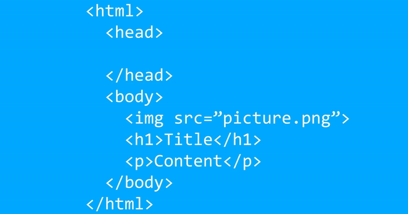

# 前言

请问同学们写过多少次 `<script src="script.js"></script>` 这行代码？可能多到数不清，但你有想过浏览器是如何处理这一行简单的代码？其实，它比看起来要复杂得多，所以篇文章中，我将逐步地分解脚本标签加载的工作原理，并且教会大家区分 `async` 和 `defer` 的差别，选用合适的方法来加快 `JavaScript` 加载时间。

## 一、浏览器是如何解析HTML的？

在谈论加快脚本标签加载速度之前，我们首先需要了解浏览器是如何解析HTML的。

### 1. 遇到静态资源标签

浏览器会从文档的顶部到底部解析HTML，当它遇到一个资源，比如一个 img 或 link 标签时，就会对该资源发出请求，然后继续解析。

**需要注意的是，浏览器不会为了获得 img src 而停止解析 HTML**。这就是为什么当你加载一个网页时，你可能会注意到页面在图片弹出时跳来跳去，因为它们是在后台加载的，而且可能在HTML解析后完成下载。下面是一个解析结果的例子。红色突出显示的文本是已经被解析过的代码。正如你所看到的，解析器并没有在 img 标签上停止，而是继续解析。



### 2. 遇到 script 标签

浏览器对 `script` 标签的解析方式有点不同。

**一旦遇到脚本标签，浏览器不会继续解析，而是停止解析，下载 JavaScript，并执行它**。这就是为什么很多时候，开发者会把他们的 `script` 标签放在HTML主体的底部，这样他们就不会耽误 HTML 的解析。正如你在下面的图片中所看到的，当到达 `script` 标签时，解析器会停止解析，并等待 JavaScript 的下载。如果 JavaScript 文件很大，这可能导致页面速度变慢。


它们之间的执行流程如下图：


你可能会认为，只是把 `script` 标签放在HTML主体的底部是最理想的。**但如果HTML文件很大，那么JavaScript将不会开始下载，直到所有的HTML被解析，这可能大大延迟JavaScript的下载**。这就是为什么在 `script` 上会有 `async` 和 `defer` 属性。

## 二、async 属性解读

第一个属性是 `async` 属性，要创建一个 `async` `script` 标签，可使用以下代码。

```html
<script async src="script.js"></script>
```

当这个属性应用于 `script` 标签时，将使 `script` 标签在解析器中像 img 标签一样工作。**这意味着解析器将在后台下载JavaScript，并继续正常解析，无需等待**。

**当 JavaScript 下载完成后，解析器将立即停止解析并执行 JavaScript**。这对于任何不依赖其他东西的小的 JavaScript 代码来说是很好的，但是由于 JavaScript 一下载就被执行，解析器仍然可能被那些需要长时间执行的 JavaScript 所延迟。

**`async` 属性的另一个巨大的缺点是，JavaScript 文件不会按照它们在 HTML 中定义的顺序执行。它们是按照下载的顺序执行的**。这意味着下载速度较快的文件总是在下载速度较慢的文件之前执行，如果 JavaScript 文件之间相互依赖，就会造成很大的问题。正因为如此，我在加载脚本标签时很少使用async。下面的动图显示了在使用 `async` 属性时，文件是如何被解析的。


## 三、defer 属性解读

与 `async` 属性类似，`defer` 属性不会停止解析去下载 JavaScript。要创建一个 `defer` `script` 标签，可以使用以下代码:

```html
<script defer src="script.js"></script>
```

解析器将在后台下载 JavaScript 并继续解析，但与 `async` 属性不同，**`defer` 属性在整个HTML文档被解析后才会执行JavaScript。**

**这意味着有了 `defer` 属性，HTML 解析就不会因为下载 JavaScript 而延迟。**

另外，由于 JavaScript 是在整个 HTML 文档被解析后执行的，所以可以保证 JavaScript 文件的顺序。**这是因为所有 `defer` 属性的 JavaScript 文件都必须在任何一个文件被执行之前被下载**。所以，我更喜欢 `defer` 属性，几乎每次加载 JavaScript 时都会使用它。

因为我可以把我的 JavaScript 放在 HTML 的头部，这样它就会尽快开始下载，而且它还可以保留我的 JavaScript 的顺序，就像在没有 `defer` 属性的情况下加载一样。

使用 `defer` 属性加载 JavaScript 与在正文末尾加载 JavaScript 基本相同，但它会更早开始下载。另外，由于 JavaScript  的执行总是 在HTML 被解析后完成的，所以不需要等待文档准备事件。当 `defer` 属性的 `script` 标签被执行时，文档将总是准备好的。下面是一段关于 `defer` 属性如何工作的动图：


## 四、浏览器的支持

当然，在谈论 Web 开发中很酷的功能时，我们不得不谈一谈可怕的浏览器支持的问题。幸运的是，`defer` 和 `async` 在大多数的浏览器中都是支持的。

## 五、总结

总之，如果你想更快地加载 JavaScript，以便你的页面能更快地渲染，你需要使用 `async` 或 `defer`。**一般来说，`defer` 属性应该是首选**，因为它的工作原理几乎与正常的脚本标签加载相同，但在特殊情况下，`async` 标签对加快页面加载速度非常有用。

***

> 每文一句：树不修，长不直；人不学，没知识。
