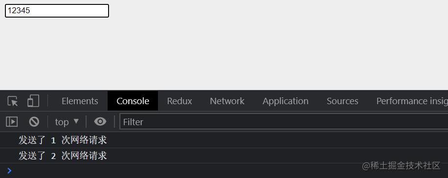

## 前言
首先我们需要明白的是：**防抖和节流是两个不同的函数，其作用也不相同**

防抖和节流的概念其实最早并不是出现在软件工程中，防抖是出现在电子元件中，节流出现在流体流动中。

那么为什么要将它们运用在程序中：
* JavaScript是事件驱动的，大量的操作会触发事件，加入到事件队列中处理。 
* 所以对于某些频繁的事件处理会造成性能的损耗，我们就可以通过防抖和节流来限制事件频繁的发生；

## 1. 认识防抖函数（debounce）
**概念：当事件触发时，相应的函数并不会立即执行，而是会等待一定的时间再执行**

防抖函数的执行过程具有以下特点：
* 当事件密集触发时，函数的执行会被频繁的推迟；
* 只有等待了一段时间也没有事件触发，才会真正的执行响应函数；

## 2. 应用场景
1. 输入框中频繁的输入内容，搜索或 者提交信息； 
2. 频繁的点击按钮，触发某个事件； 
3. 监听浏览器滚动事件，完成某些特定操作； 
4. 用户缩放浏览器的resize事件
5. ......

## 3. 防抖函数的案例分析
我们都遇到过这样的场景，**在某个搜索框中输入自己想要搜索的内容**：

举个例子，比如想搜索iphone：


* 当我输入 i 时，为了更好的用户体验，通常会出现对应的联想内容，这些联想内容通常是保存在服务器的，所以需要一次网络请求；
* 当继续输入 ip 时，再次发送网络请求；
* 那么 iphone 一共需要发送6次网络请求；
* 这大大损耗我们整个系统的性能，无论是前端的事件处理，还是对于服务器的压力;

但是我们需要这么多次的网络请求吗？
* 不需要，正确的做法应该是在合适的情况下再发送网络请求； 
* 比如如果用户快速的输入一个 iphone，那么只是发送一次网络请求； 
* 比如如果用户是输入一个 i 想了一会儿，这个时候 i 确实应该发送一次网络请求； 
* 也就是我们应该监听用户在某个时间，比如500ms内，没有再次触发时间时，再发送网络请求；

**这就是防抖的操作：只有在某个时间内，没有再次触发某个函数时，才真正的调用这个函数；**

## 4. 手写防抖函数
本次的防抖函数，我们将按照如下思路来实现，通过一次次的优化，让函数具备更强的通用性：

1. 防抖基本功能实现：可以实现防抖效果 v1
2. 优化一：优化this指向和参数 v2
3. 优化二：增加立即执行效果（第一次立即执行）v3
4. 优化三：增加取消功能 v4

### 4.1 防抖基本实现 v1
**实现步骤：**
1. 防抖函数的返回值是一个函数
2. 定义变量，保存上一次的定时
3. 如果时间内在次触发，要取消上一次的定时，重新开始定时
4. 开始延时执行
5. 执行外部转入的真正要执行的函数

```js
// debounce.js
function debounce(fn, delay) {
  
  let timer = null  // 2
    
  const _debounce = function() {
    if (timer) clearTimeout(timer)  // 3

    timer = setTimeout(() => {  // 4
      fn()  // 5
      timer = null
    }, delay)
  }

  return _debounce  // 1
}
```
注意：执行外部传入的函数之后，要重置定时器变量，不然下一次使用的`timer`值就是上一次的值，虽然会被上面的判断清空，但是增加了无用的判断。

测试：
```html
<body>
    <input type="text" />
</body>
<script>
    const inputEl = document.querySelector('input')
    let counter = 0

    const inputChange = function(event) {
      console.log(`发送了 ${++counter} 次网络请求`)
    }

    inputEl.oninput = debounce(inputChange, 1000)
</script>
```
运行结果下图：


可以看到，如果是在1秒之内继续输入的话，是不会输出的，所以最后只请求了3次

### 4.2 优化this指向和参数 v2
v1版本的防抖函数已经具备了最基本的防抖功能了，但是有个问题，如果事件的回调函数内需要用到this，或者event，那么是有问题的，按道理this应该指向触发事件的对象，event是有值的
```
const inputChange = function(event) {
  console.log(`发送了 ${++counter} 次网络请求`, this, event)
}
```


解决方法：只需要在调用函数时改变this指向，然后传入参数即可，看注释代码：
```js
function debounce(fn, delay) {
  let timer = null

  const _debounce = function(...args) {
    if (timer) clearTimeout(timer)

    timer = setTimeout(() => {
      fn.apply(this, args) // 改变this指向，然后传入参数
      timer = null
    }, delay)
  }

  return _debounce
}
```
运行结果如下图：


### 4.3 增加立即执行效果 v3
在第一次输入时无需等待，立即执行函数
* 这种效果属于开发者选择是否需要使用，所以需要接收一个参数`immediate`，默认为false
* 定义一个变量 `isInvoke`，判断是否执行过一次，默认为false

具体修改部分看注释，代码如下：
```js
function debounce(fn, delay, immediate=false) {
  let timer = null
  let isInvoke = false  // 是否执行过

  const _debounce = function(...args) {
    if (timer) clearTimeout(timer)

    // 判断是否需要立即执行
    if (immediate && !isInvoke) {
      fn.apply(this, args)
      timer = null
      isInvoke = true // 改为true
    } else {
      timer = setTimeout(() => {
        fn.apply(this, args)
        timer = null
        isInvoke = false // 改为true
      }, delay)
    }
  }

  return _debounce
}
```
使用debounce函数时，传入true
```js
inputEl.oninput = debounce(inputChange, 1000, true)
```
这里看不出效果，可以在自己运行电脑看看效果：


### 4.4 增加取消功能 v4
取消功能比较简单，只需要额外定义一个函数，清除定时器和修改isInvoke即可

具体修改部分看注释，代码如下：
```js
function debounce(fn, delay, immediate=false) {
  let timer = null
  let isInvoke = false

  const _debounce = function(...args) {
    if (timer) clearTimeout(timer)

    if (immediate && !isInvoke) {
      fn.apply(this, args)
      timer = null
      isInvoke = true
    } else {
      timer = setTimeout(() => {
        fn.apply(this, args)
        timer = null
        isInvoke = false
  
      }, delay)
    }
  }

  // 取消执行的函数（清除定时器和修改isInvoke即可）
  _debounce.cancel = function() {
    clearTimeout(timer)
    isInvoke = false
  }

  return _debounce
}
```
修改测试代码
```html
 <body>
    <input type="text" />
    <button id="cancel">取消</button>
 </body>
 <script>
    const inputEl = document.querySelector('input')
    const btn = document.getElementById('cancel')

    let counter = 0

    const inputChange = function(event) {
      console.log(`发送了 ${++counter} 次网络请求`, this, event)
    }

    const _debounce = debounce(inputChange, 1000)

    // 输入框的input事件
    inputEl.oninput = _debounce

    // 取消按钮的点击事件
    btn.onclick = function() {
      _debounce.cancel()
    }
</script>
```
运行结果如下图：


输入内容后，在一秒内点击取消按钮就会触发`cancel()`，清除了定时器，所以也就没有执行输入的回调函数

防抖函数就讲到这里相信同学们应该掌握的差不多了，接下来讲解节流函数
***
## 5. 认识节流函数（throttle）
**概念：当多个事件在规定时间内多次触发，回调函数最终只会执行一次**

节流函数的执行过程具有以下特点：
* 如果这个事件会被频繁触发，那么节流函数会按照一定的频率来执行函数；
* 不管在这个中间有多少次触发这个事件，执行函数的频繁总是固定的；

## 6. 应用场景
1. 监听页面的滚动事件；
2. 鼠标移动事件；
3. 用户频繁点击按钮操作；
4. 游戏中的一些设计；
5. ......

## 7. 节流函数的案例分析
很多人都玩过类似于飞机大战的游戏，在飞机大战的游戏中，我们按下空格会发射一个子弹：


* 很多飞机大战的游戏中会有这样的设定，即使按下的频率非常快，子弹也会保持一定的频率来发射； 
* 比如1秒钟只能发射一次，即使用户在这1秒钟按下了10次，子弹会保持发射一颗的频率来发射； 
* 但是事件是触发了10次的，响应的函数只触发了一次

## 8. 手写节流函数

本次的节流函数，我们也与防抖函数类似，按照如下思路来实现，通过一次次的优化，让函数具备更强的通用性：

1. 节流函数的基本实现：可以实现节流效果 v1
2. 优化一：控制第一次是否执行 v2
3. 优化一：节流最后一次也可以执行 v3
4. 优化二：优化添加取消功能 v4

### 8.1 节流函数的基本实现 v1
**实现步骤：**
1. 节流函数的返回值是一个函数
2. 记录上一次的开始时间
3. 获取当前事件触发时的时间
4. 计算出还剩余多长时间需要去触发函数
5. 真正触发函数，保留上次触发的时间，并保存时间

```js
// throttle.js
function throttle(fn, interval) {
  let lastTime = 0  // 2

  const _throttle = function() {
    const nowTime = Date.now()  // 3
    // 4 计算出还剩余多长时间需要去触发函数
    const remainTime = interval - (nowTime - lastTime)
    
    if (remainTime <= 0) {
      // 5
      fn()
      lastTime = nowTime
    }
  }

  return _throttle  // 1
}
```
测代代码：
```html
  <body>
    <input type="text" />
    <script>
      const inputEl = document.querySelector('input')

      let counter = 0
      const inputChange = function(event) {
        console.log(`发送了 ${++counter} 次网络请求`)
      }
      // 输入框的input事件
      inputEl.oninput = throttle(inputChange, 2000)
    </script>
  </body>
```
运行结果如下图：


说明：2秒内按再多次，回调函数也只执行一次

### 8.2 控制第一次是否执行 v2
在v1版本的节流函数代码中第一次是会执行的，但有时候开发者不想第一次就执行，所以我们要通过一个配置控制第一次是否要执行

实现原理：
* 想实现这个功能也比较简单，只需要在调用`throttle()`时，传入自定义配置变量`leading`即可，`leading`默认为`true`，也就是默认第一次会执行。

* 然后根据`lastTime`和`leading`去判断，如果都为`false` 就让`lastTime`和`nowTime`相等，目的是为了让`remainTime`大于0，从而不去执行回调函数`fn()`，以达到第一次不会执行的效果。


具体修改部分看注释，代码如下：
```js
function throttle(fn, interval, options = { leading: true }) {
  const { leading } = options // 取出配置变量
  let lastTime = 0

  const _throttle = function() {
    const nowTime = Date.now()

    // 如果第一次的最后时间为0 和 leading为 false时，让lastTime = nowTime（其实就是让remainTime大于0）
    if (!lastTime && !leading) lastTime = nowTime

    const remainTime = interval - (nowTime - lastTime)
    if (remainTime <= 0) {
      fn()
      lastTime = nowTime
    }
  }

  return _throttle
}
```
测试代码：
```js
// 配置 leading 为 false
inputEl.oninput = throttle(inputChange, 2000, {leading: false})
```
运行结果如下图：


### 8.3 节流最后一次也可以执行 v3
让节流最后一次也可以执行是什么意思呢？就是在规定时间内，不仅输出了规定的那一次，并且最后一次的输入也要可以执行，如果是v2版本是做不到这一点的。

那么如何去做到这一点呢，实现核心是使用定时器，并且让`remainTime`作为定时器的初始时间。

这里可以延续上面的做法，让开发者在调用`throttle()`时，传入自定义配置变量`trailing`为`true`，默认情况下为`false`。

具体步骤如下：
* 取出配置变量`trailing`，定义变量`timer`保存定时器
* 如果是正常判断下，不需要每一秒都添加定时器，所以要清空定时器并`return`
* 如果`trailing`为`true`，且`timer`为空时，执行定时器
* 如果`leading`为`false`，则设置为`0`，否则设置为当前时间

具体修改部分看注释，代码如下：
```js
function throttle(fn, interval, options = { leading: true, trailing: false }) {
  const { leading, trailing } = options // 取出配置变量
  let lastTime = 0
  let timer = null // 保存定时器

  const _throttle = function() {
    const nowTime = Date.now()

    if (!lastTime && !leading) lastTime = nowTime

    const remainTime = interval - (nowTime - lastTime)
    if (remainTime <= 0) {
      // 如果是正常判断下，不需要每一秒都添加定时器，所以要清空定时器
      if (timer) {
        clearTimeout(timer)
        timer = null
      }
      fn()
      lastTime = nowTime
      return // 并且return出去
    }

    // 如果 trailing为true，且timer为空时，执行定时器
    if (trailing && !timer) {
      timer = setTimeout(() => {
        timer = null
        // 如果 leading 为false，则设置为 0，否则为当前时间
        lastTime = !leading ? 0 : Date.now()
        fn()
      }, remainTime)
    }
  }

  return _throttle
}
```
测试代码：
```js
// 输入框的input事件
inputEl.oninput = throttle(inputChange, 2000, {
  leading: false,
  trailing: true
})
```
运行结果如下图：

说明：前面两次输出为正常输出，第三次输出是最后一次输入1的输出

实际上，节流函数也可以进行类似防抖函数的【优化this指向和参数】和【取消功能】的版本优化，它们的实现方式都是差不多的，这里就不写了，留给同学们自己完成吧。

## 9. 最后总结
最后对防抖节流的概念进行一次总结：

防抖函数：**当事件触发时，相应的函数并不会立即执行，而是会等待一定的时间再执行**

节流函数：**当多个事件在规定时间内多次触发，回调函数最终只会执行一次**

> 每文一句：不要吹灭你的灵感和你的想象力; 不要成为你的模型的奴隶。 ——文森特・梵高
