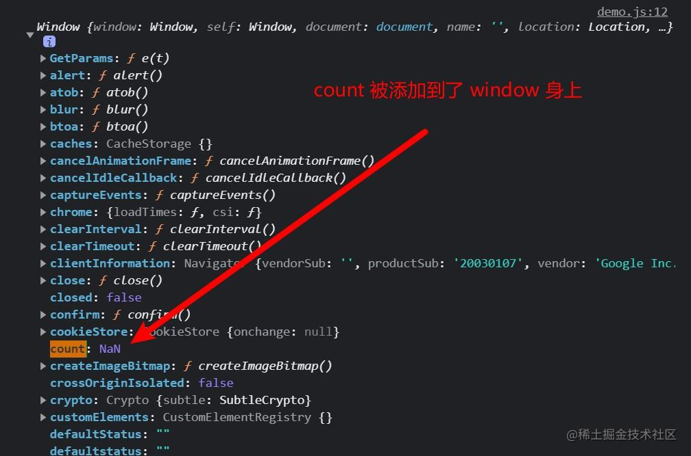

## 1. 关于 this 的简单介绍

:::tip
this 关键字是 JavaScript 中最复杂的机制之一。它是一个很特别的关键字，被自动定义在所有函数的作用域中。但是即使是非常有经验的 JavaScript 开发者也很难说清它到底指向什么。

> 任何足够先进的技术都和魔法无异。— Arthur C. Clarke
:::


实际上，JavaScript 中 this 的机制并没有那么先进，但是开发者往往会把理解过程复杂化， 毫无疑问，在缺乏清晰认识的情况下，this 对你来说完全就是一种魔法。

## 2. 为什么使用 this？
```js
const obj = {
  title: '掘金',
  reading() {
    console.log(this.title + '，一个帮助开发者成长的社区');
  }
}
```
this 提供了一种更优雅的方式来隐式“传递”一个对象引用，因此可以将 API 设计得更加简洁并且易于复用。

随着你的使用模式越来越复杂，显式传递上下文对象会让代码变得越来越混乱，使用 this 则不会这样。当我们介绍对象和原型时，你就会明白函数可以自动引用合适的上下文对象有多重要

## 3. 关于this 的常见的误解
**人们很容易把 this 理解成指向函数自身**，JavaScript 的新手开发者通常会认为，既然把函数看作一个对象（JavaScript 中的所有函数 都是对象），那就可以在调用函数时存储状态（属性的值）。但结果通常让他们大吃一惊，例如下面这段代码
```js
function foo() {
  // 让新添加的 count + 1
  this.count++
}

// 向函数对象 foo 添加了一个属性 count
foo.count = 0

foo()

console.log(foo.count);   // 0 
```
这段代码看起来没什么问题，但请把目光聚焦到最后一行，输出 `foo.count` 的结果竟然是0 ？！

**疑问**：为什么会这样？我明明向函数对象 `foo` 添加了一个属性 `count`，并且函数内部也写了 `this.count++`，为什么最后还是`0`呢？

**解答**：因为`this.count` 中此时的 this，根本不是指向 foo 函数自身，**而是指向全局 `window`**。再细心一点，我们可以发现，在 `window` 身上，被添加了个 `count` 属性，值为 NaN。
（为什么 this 指向 window 后面会阐述）

所以，单纯的把 this 理解为指向函数自身是错误的。

**this 实际上是在函数被调用时发生的绑定，它指向什么完全取决于函数在哪里被调用。**
## 4. this 的绑定规则
我们来看看在函数的执行过程中调用位置如何决定 this 的绑定对象。 

找到调用位置，然后判断需要应用下面四条规则中的哪一条。我首先会分别解释 这四条规则，然后解释多条规则都可用时它们的优先级如何排列。
### 4.1 默认绑定
首先要介绍的是最常用的函数调用类型：**独立函数调用**。可以把这条规则看作是无法应用其他规则时的默认规则。
```js
function foo() {
  console.log(this.a)
}
var a = 2
foo() // 2
```
1. 我们可以看到当调用 `foo()` 时，`this.a` 被解析成了全局变量 `a`。为什么？因为在本例中，**函数调用时应用了 `this` 的默认绑定，因此 `this` 指向全局对象**。

2. 那么我们怎么知道这里应用了默认绑定呢？可以通过分析调用位置来看看 `foo()` 是如何调 用的。在代码中，`foo()` **是直接使用不带任何修饰的函数引用进行调用的，因此只能使用默认绑定，无法应用其他规则**

3. 这条规则也解释了上面 count 的代码中，为什么函数里面的`this`指向了`window`，因为 `foo` 是**属于独立函数调用的，触发了默认绑定，从而指向全局window**。（浏览器中全局是 window对象，node 中是空对象{}）

4. 属于默认绑定规则的还有：
    * 函数调用链（一个函数又调用另外一个函数）
    * 将函数作为参数，传入到另一个函数中


（扩展：如果使用严格模式（strict mode），则不能将全局对象用于默认绑定，因此 this 会绑定到 undefined：）

>**结论：默认绑定的 `this`，都指向全局。**


### 4.2 隐式绑定
#### 4.2.1 一般的对象调用
这一条需要考虑的规则是调用位置是否有上下文对象，或者说**是通过某个对象发起的函数调用**
```js
function foo() {
  console.log(this.a)
}

const obj = {
  a: 2,
  foo: foo
}

// 通过 obj 对象调用 foo 函数
obj.foo() // 2
```
1. 调用位置会使用 obj 上下文来引用函数，因此你可以说函数被调用时 obj 对象“拥 有”或者“包含”它。
2. `foo()` 被调用时，它的前面确实加上了对 `obj` 的引用。当函数引用有上下文对象时，**隐式绑定规则会把函数调用中的 `this` 绑定到这个上下文对象**。因为调用 `foo()` 时 `this` 被绑定到 `obj` 上，因此 `this.a` 和 `obj.a` 是一样的。

#### 4.2.2 对象属性引用链
对象属性引用链中只有**上一层或者说最后一层**在调用位置中起作用。举例来说：
```js
function foo() {
  console.log(this.a)
}

var obj2 = {
  a: 2,
  foo: foo
}

var obj1 = {
  a: 1,
  obj2: obj2
}

obj1.obj2.foo() // 2
```
最终 `this` 指向的是 `obj2`
#### 4.2.3 隐式丢失
一个最常见的 this 绑定问题就是被隐式绑定的函数会丢失绑定对象，也就是说它会应用**默认绑定**，从而把 this 绑定到全局对象或者 undefined 上（取决于是否是严格模式）

**第一种情况：将对象里的函数赋值给一个变量**
```js
function foo() {
  console.log(this.a)
}

var obj = {
  a: 2,
  foo: foo
}

var bar = obj.foo // 函数别名！

var a = 'global' // a 是全局对象的属性
bar() // "global"
```
虽然 `bar` 是 `obj.foo` 的一个引用，但是实际上，它引用的是 `foo` 函数本身，因此此时的 `bar()` 其实是一个不带任何修饰的函数调用，因此应用了**默认绑定**。

**第二种情况：传入回调函数时**
```js
function foo() {
  console.log(this.a)
}

function doFoo(fn) {
  // fn 其实引用的是 foo
  fn() // <-- 调用位置！
}

var obj = {
  a: 2,
  foo: foo
}

var a = 'global'  // a 是全局对象的属性
doFoo(obj.foo)    // "global"
```
参数传递其实就是一种**隐式赋值**，因此我们传入函数时也会被隐式赋值，所以结果和上一 个例子一样。

>**结论：隐式绑定的 this，指向调用函数的上下文对象。**

### 4.3 显式绑定
#### 4.3.1 使用 call(...) 和 apply(...)
如果我们不想在对象内部包含函数引用，而想在某个对象上强制调用函数，该怎么做呢？
**可以使用函数的 `call(..)` 和 `apply(..)` 方法**

* JavaScript 提供的绝大多数函数以及你自 己创建的所有函数都可以使用 `call(..)` 和 `apply(..)` 方法。

这两个方法是如何工作的呢？它们的第一个参数是一个对象，是给 this 准备的，接着在调用函数时将其绑定到 this。**因为你可以直接指定 this 的绑定对象，因此我们称之为显式绑定。** 思考以下代码：
```js
function foo() {
  console.log(this.a)
}

var obj = {
  a: 2
}

foo.call(obj) // 2
```
1. 通过 `foo.call(..)`，我们可以在调用 `foo` 时强制把它的 `this` 绑定到 `obj` 上。
2. 如果你传入了一个原始值（字符串类型、布尔类型或者数字类型）来当作 this 的绑定对 象，这个原始值会被转换成它的对象形式（也就是 new String(..)、new Boolean(..) 或者 new Number(..)）。这通常被称为“装箱”。

> 从 this 绑定的角度来说，call(..) 和 apply(..) 是一样的，它们的区别体现在参数上：第一个参数是相同的，后面的参数，call为参数列表，apply为数组，他们内部的实现原理也不难理解，详细请看以下两个手写方法
> 
> * [手写 call 方法 超级详细 ⚡⚡⚡](https://juejin.cn/post/7128028573520101390)
> 
> * [手写 apply 方法 超级详细 ⚡⚡⚡](https://juejin.cn/post/7128213514006560775)

#### 4.3.2 硬绑定（一个函数总是显示的绑定到一个对象上）
由于硬绑定是一种非常常用的模式，所以 ES5 提供了内置的方法 `Function.prototype.bind`， 它的用法如下
```js
function foo(num) {
  console.log(this.a, num)
  return this.a + num
}

var obj = {
  a: 2
}

// 调用 bind() 方法，返回一个函数
var bar = foo.bind(obj)

var b = bar(3) // 2 3

console.log(b) // 5
```
调用 `bind(...)` 方法，会返回一个新函数，那么这个新函数的 `this`，永远指向我们传入的`obj`对象
> 关于 bind 方法的简单实现，可以前往：[手写 bind 方法，超级详细 ⚡⚡⚡](https://juejin.cn/post/7128553917348053028)
#### 4.3.3 API调用的 “上下文（内置函数）
第三方库的许多函数，以及 JavaScript 语言和宿主环境中许多新的内置函数，都提供了一个可选的参数，通常被称为“上下文”（context），其作用和 `bind(..)` 一样，确保你的回调函数使用指定的 `this`。例如：

**（1）数组方法 `forEach()`**
```js
function foo(el) {
  console.log(el, this.id)
}

var obj = {
  id: 'bin'
};

[1, 2, 3].forEach(foo, obj)

// 输出：
// 1 bin 
// 2 bin 
// 3 bin
```
* 调用 foo(..) 时把 this 绑定到 obj 身上


**（2）`setTimeout()`**
```js
setTimeout(function() {
  console.log(this); // window
}, 1000);
```
* 在使用 setTimeout 时会传入一个回调函数，而这个回调函数中的`this`一般指向 `window`，这个和 setTimeout 源码的内部调用有关，这个不再展开赘述

> **结论：显式绑定的 this，指向我们指定的绑定对象。**

### 4.4 new 绑定
在 JavaScript 中，普通函数可以使用 `new` 操作符去调用，此时的普通函数则被称为 **“构造函数”**。没错，凡是由 `new` 操作符调用的函数，都称为 **“构造函数”**

使用 new 来调用函数，或者说发生构造函数调用时，会自动执行下面的操作。

1. 在内存中创建一个新对象。
2. 这个新对象内部的[[Prototype]] 特性被赋值为构造函数的 prototype 属性。
3. 构造函数内部的this 被赋值为这个新对象（即this 指向新对象）。
4. 执行构造函数内部的代码（给新对象添加属性）。
5. 如果构造函数返回非空对象，则返回该对象；否则，返回刚创建的新对象。

```js
function foo(a) {
  this.a = a
}

var bar = new foo(2)

console.log(bar.a) // 2
```
使用 `new` 来调用 `foo(..)` 时，我们会构造一个新对象并把它绑定到 `foo(..)` 调用中的 `this` 上。`new` 是最后一种可以影响函数调用时 `this` 绑定行为的方法，我们称之为 **new 绑定**。
> **结论：new 绑定的 this，都指向通过 new 调用的函数的实例对象（就是该函数）**

## 5. 绑定规则的优先级
现在我们已经了解了函数调用中 this 绑定的四条规则，你需要做的就是找到函数的调用位置并判断应当应用哪条规则。但是，如果某个调用位置可以应用多条规则呢？所以就需要有绑定规则的优先级。

它们之间的优先级关系为：

**默认绑定 < 隐式绑定 < 显示绑定（bind） < new绑定**

这里提前列出优先级，想看详细代码解析的可以往下看，也可以直接拖到最后面的例题部分

### 5.1 默认绑定的优先级最低
毫无疑问，默认规则的优先级是最低的，因为存在其他规则时，就会通过其他规则的方式来绑定this

### 5.2 隐式绑定和显式绑定的优先级比较
测试一下即可知道，有以下代码：
```js
function foo() {
  console.log(this.a)
}

var obj1 = {
  a: 1,
  foo: foo
}

var obj2 = {
  a: 2,
  foo: foo
}

// 同时使用隐式绑定和显示绑定
obj1.foo.call(obj2) // 2
```
可以看到，输出的结果为 2，说明 `foo` 函数内 `this` 指向的是 `obj2`，而 obj2 是通过显示绑定调用的，所以：**显示绑定的优先级更高**

### 5.3 隐式绑定和 new 绑定的优先级比较
有以下测试代码：
```js
function foo() {
  console.log(this);
}

var obj = {
  title: "juejin",
  foo: foo
}

// 同时使用隐式绑定和new绑定
new obj.foo(); // foo对象
```
最后 `foo` 函数输出的 `this` 为 foo 对象，说明new绑定优先级更高（否则应该输出 obj 对象），所以：**new 绑定的优先级更高**

### 5.4 new 绑定和显示绑定的优先级比较
最后，new 绑定和显式绑定谁的优先级更高呢？
> new绑定和call、apply是不允许同时使用的，只能和 bind 相比较，如下：
```js
function foo() {
  console.log(this)
}

var obj = {
  title: "juejin"
}

var foo = new foo.call(obj);  // 直接报错
```

但是 new 绑定可以和 bind 方法返回后的函数一起使用
```js
function foo() {
  console.log(this);
}

var obj = {
  title: "juejin"
}

var bar = foo.bind(obj);

var foo = new bar(); // foo 对象, 说明使用的是new绑定
```
最后 `foo` 函数输出的 `this` 为 foo 对象，说明new绑定优先级更高（否则应该输出 obj 对象），所以：**new 绑定的优先级更高**

> **优先级结论：默认绑定 < 隐式绑定 < 显示绑定（bind）< new绑定**

## 6. 判断this
现在我们可以根据优先级来判断函数在某个调用位置应用的是哪条规则。可以按照下面的 顺序来进行判断：
1. 函数是否在 new 中调用（new 绑定）？如果是的话 this 绑定的是新创建的对象。 var bar = new foo()
2. 函数是否通过 call、apply（显式绑定）或者硬绑定调用？如果是的话，this 绑定的是 指定的对象。 var bar = foo.call(obj2) 
3. 函数是否在某个上下文对象中调用（隐式绑定）？如果是的话，this 绑定的是那个上 下文对象。 var bar = obj1.foo() 
4. 如果都不是的话，使用默认绑定。如果在严格模式下，就绑定到 undefined，否则绑定 到全局对象。 var bar = foo()

就是这样。对于正常的函数调用来说，理解了这些知识你就可以明白 this 的绑定原理了。 不过……凡事总有例外

## 7. 绑定例外
> 规则总有例外，这里也一样。在某些场景下 this 的绑定行为会出乎意料，你认为应当应用其他绑定规则时，实际上应用的可能是默认绑定规则。

### 7.1 箭头函数
箭头函数不使用 this 的四种标准规则，而是根据外层（函数或者全局）作用域来决定 this。

### 7.2 被忽略的this
如果你把 null 或者 undefined 作为 this 的绑定对象传入 call、apply 或者 bind，这些值在调用时会被忽略，实际应用的是默认绑定规则：
```js
function foo() {
  console.log(this.a)
}

var a = 2

foo.call(null) // 2
foo.call(undefined) // 2
foo.bind(null)();
```
最后输出的结果都是 2，说明 `this` 指向的是全局 `window`

### 7.3 间接引用
另一个需要注意的是，你有可能（有意或者无意地）创建一个函数的**间接引用**，在这种情况下，调用这个函数会应用默认绑定规则。 间接引用最容易在赋值时发生：
```js
function foo() {
  console.log(this.a)
}
var a = 2
var o = { a: 3, foo: foo }
var p = { a: 4 }

o.foo(); // 3

// 函数赋值
(p.foo = o.foo)()  // 2
```
赋值表达式 `p.foo = o.foo` 的返回值是目标函数的引用，因此调用位置是 `foo()` 属于独立函数调用，而不是 `p.foo()` 或者 `o.foo()`。根据我们之前说过的，这里会应用默认绑定。

## 8. this 判断例题
请说出例题中的输出结果
### 8.1 例题一
```js
var name = "window";
var person = {
  name: "person",
  sayName: function () {
    console.log(this.name);
  }
};
function sayName() {
  var sss = person.sayName;
  sss(); 
  person.sayName(); 
  (person.sayName)(); 
  (b = person.sayName)(); 
}
sayName();
```
解析：
```js
function sayName() {
  var sss = person.sayName;
  // 独立函数调用，没有和任何对象关联
  sss(); // window
  // 关联
  person.sayName(); // person
  (person.sayName)(); // person
  (b = person.sayName)(); // window
}
```
### 8.2 例题二
```js
var name = 'window'
var person1 = {
  name: 'person1',
  foo1: function () {
    console.log(this.name)
  },
  foo2: () => console.log(this.name),
  foo3: function () {
    return function () {
      console.log(this.name)
    }
  },
  foo4: function () {
    return () => {
      console.log(this.name)
    }
  }
}

var person2 = { name: 'person2' }

person1.foo1(); 
person1.foo1.call(person2); 

person1.foo2();
person1.foo2.call(person2);

person1.foo3()();
person1.foo3.call(person2)();
person1.foo3().call(person2);

person1.foo4()();
person1.foo4.call(person2)();
person1.foo4().call(person2);
```
解析：
```js
// 隐式绑定，肯定是person1
person1.foo1(); // person1
// 隐式绑定和显示绑定的结合，显示绑定生效，所以是person2
person1.foo1.call(person2); // person2

// foo2()是一个箭头函数，不适用所有的规则
person1.foo2() // window
// foo2依然是箭头函数，不适用于显示绑定的规则
person1.foo2.call(person2) // window

// 获取到foo3，但是调用位置是全局作用于下，所以是默认绑定window
person1.foo3()() // window
// foo3显示绑定到person2中
// 但是拿到的返回函数依然是在全局下调用，所以依然是window
person1.foo3.call(person2)() // window
// 拿到foo3返回的函数，通过显示绑定到person2中，所以是person2
person1.foo3().call(person2) // person2

// foo4()的函数返回的是一个箭头函数
// 箭头函数的执行找上层作用域，是person1
person1.foo4()() // person1
// foo4()显示绑定到person2中，并且返回一个箭头函数
// 箭头函数找上层作用域，是person2
person1.foo4.call(person2)() // person2
// foo4返回的是箭头函数，箭头函数只看上层作用域
person1.foo4().call(person2) // person1
```

## 9. 总结
如果要判断一个运行中函数的 this 绑定，就需要找到这个函数的直接调用位置。找到之后就可以顺序应用下面这四条规则来判断 this 的绑定对象。
1. 由 new 调用？绑定到新创建的对象。 
2. 由 call 或者 apply（或者 bind）调用？绑定到指定的对象。 
3. 由上下文对象调用？绑定到那个上下文对象。
4. 默认：在严格模式下绑定到 undefined，否则绑定到全局对象。

***
>每文一句：如果把生活比喻为创作的意境，那么阅读就像阳光。

ok，本次的分享就到这里，如果本章内容对你有所帮助的话可以**点赞+收藏**，希望大家都能够有所收获。有任何疑问都可以在评论区留言，大家一起探讨、进步！
