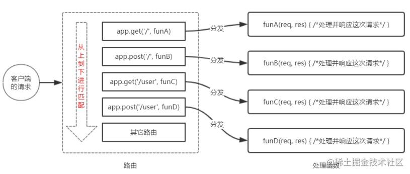

:::tip[学习目标]
1. 能够使用 express.static() 快速托管静态资源
2. 能够使用 express 路由精简项目结构
3. 能够使用常见的 express 中间件
4. 能够使用 express 创建 API 接口
5. 能够在 express 中启用 cors 跨域资源共享

Express [中文官网](http://www.expressjs.com.cn/)
:::

## 1. 什么是路由
广义上来讲，路由就是**映射关系**

## 2. Express 中的路由
在 Express 中，路由指的是**客户端的请求**与**服务器处理函数**之间的**映射关系**。

Express 中的路由分 3 部分组成，分别是**请求的类型、请求的 URL 地址、处理函数**，格式如下
```js
// METHOD 请求的方法
// path 请求访问的路径
// HANDLER 访问成功的处理函数
app.METHOD(path, HANDLER)
```

## 3.Express 中的路由的例子
```js
// 匹配 GET 请求，且请求 URL 为 /
app.get('/', (req, res) => {
  res.send('Hello World')
})

// 匹配 POST 请求，且请求 URL 为 /
app.post('/', (req, res) => {
  res.send('Post request')
})
```

## 4. 路由的匹配过程
每当一个请求到达服务器之后，需要先经过路由的匹配，只有匹配成功之后，才会调用对应的处理函数。

在匹配时，会按照路由的顺序进行匹配，如果**请求类型**和**请求的 URL**同时匹配成功，则 Express 会将这次请求，转交给对应的 function 函数进行处理。

路由的匹配过程

路由匹配的注意点：
* 按照定义的**先后顺序**进行匹配
* **请求类型**和**请求的URL**同时匹配成功，才会调用对应的处理函数

## 5. 路由的简单使用
在 Express 中使用路由最简单的方式，就是把路由挂载到 app 上，示例代码如下：
```js
const express = require('express')
const app = express()

// 挂载路由
app.get('/', (req, res) => {
  res.send('hello world')
})
app.post('/', (req, res) => {
  res.send('post request')
})

app.listen('80', () => {
  console.log('express server running at http://127.0.0.1');
})
```

## 6. 路由模块化
为了**方便对路由进行模块化的管理**，Express **不建议**将路由直接挂载到 app 上，而是**推荐将路由抽离为单独的模块**。
将路由抽离为单独模块的步骤如下：
1. 创建路由模块对应的 .js 文件
2. 调用 `express.Router()` 函数创建路由对象
3. 向路由对象上挂载具体的路由
4. 使用 `module.exports` 向外共享路由对象
5. 使用 `app.use()` 函数注册路由模块

### 6.1 创建路由模块，新建一个 `router.js` 文件
```js
/* 这是路由模块 */

// 导入 express
const express = require('express')
// 创建路由对象
const router = express.Router()

// 挂载具体的路由
router.get('/user/list', (req, res) => {
  res.send('Get user list')
})
router.post('/user/add', (req, res) => {
  res.send('Add new user')
})

// 向外导出路由对象
module.exports = router
```
### 6.2 注册路由模块，`app.js` 中
```js
const express = require('express')
const app = express()

// 导入路由模块
const router = require('./router.js')
// 使用 app.use() 注册路由模块
// 注意：app.use() 函数的作用就是注册全局中间件
app.use(router)

app.listen('80', () => {
  console.log('express server running at http://127.0.0.1');
})
```

## 7. 为路由模块添加前缀
类似于托管静态资源时，为静态资源统一挂载访问前缀一样，路由模块添加前缀的方式也非常简单：
```js
const express = require('express')
const app = express()

// 导入路由模块
const router = require('./router')
// 为路由模块添加前缀（也可以不加），访问时，必须带有此前缀才能访问成功
app.use('/api' ,router)

app.listen('80', () => {
  console.log('express server running at http://127.0.0.1');
})
```
***
> 每文一句：青年是学习智慧的时期，中年是付诸实践的时期。
