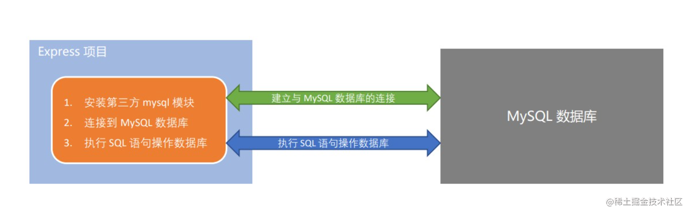

## 1. 在项目中操作数据库的步骤
1. 安装操作 MySQL 数据库的第三方模块（mysql）
2. 通过 mysql 模块连接到 MySQL 数据库
3. 通过 mysql 模块执行 SQL 语句



## 2. 安装 mysql 模块
mysql 模块是托管于 npm 上的第三方模块。它提供了在 Node.js 项目中连接和操作 MySQL 数据库的能力。

想要在项目中使用它，需要先运行如下命令，将 mysql 安装为项目的依赖包：
```shell
npm i mysql
```

## 3. 配置 mysql 模块
在使用 mysql 模块操作 MySQL 数据库之前，必须先对 mysql 模块进行必要的配置，主要的配置步骤如下：
```js
// 1. 导入 mysql 模块
const mysql = require('mysql')

// 2. 建立与 MySql 数据库的连接关系
const db = mysql.createPool({
  host: '127.0.0.1',     // 数据库的 IP 地址
  user: 'root',          // 登录数据库的账号,
  password: 'xxxxxx',    // 登录数据库的密码
  database: 'my_db_01'   // 指定要操作的数据库
})
```

## 4. 测试 mysql 模块能否正常工作
调用 `db.query()` 函数，指定要执行的 SQL 语句，通过回调函数拿到执行的结果：
```js
// 1. 导入 mysql 模块
const mysql = require('mysql')

// 2. 建立与 MySql 数据库的连接关系
const db = mysql.createPool({
  host: '127.0.0.1',      // 数据库的 IP 地址
  user: 'root',           // 登录数据库的账号,
  password: 'zhu123',     // 登录数据库的密码
  database: 'my_db_01'    // 指定要操作的数据库
})

/*** 检测 mysql 模块能否正常工作 ***/
db.query('SELECT 1', (err, results) => {
  // 查询失败
  if (err) return console.log(err.message)
  // 只要能打印出 [ RowDataPacket { '1' : 1 } ] 的结果，就证明数据库连接正常
  console.log(results);
})

```

## 5. 查询数据
```js
//todo  查询 my_db_01 数据库中 user 表的所有数据
const sqlStr = 'select * from  user'
db.query(sqlStr, (err, results) => {
  // 执行 sql 语句失败
  if (err) return console.log(err.message)
  console.log(results);
})
```
*注意**：如果执行的是 `select` 查询语句，则执行的结果是一个数组

## 6. 插入数据
```js
//todo  向 user 表插入一条数据，其中 username 的值为 jhon，password 的值为 123
// 定义数据对象
const user = { username: 'jhon', password: '123' }
// 定义待执行的 sql 语句，其中的 问号 ? 为占位符，表示待定的值
const sqlStr = 'insert into user (username, password) values (?, ?)'
// 执行 sql 语句，db.query(sql语句, sql语句中 ? 的值，回调函数)，数组中 ? 的值的顺序不能乱
db.query(sqlStr, [user.username, user.password], (err, results) => {
  // 执行 sql 语句失败
  if (err) return console.log(err.message)
  // 插入数据成功
  if (results.affectedRows === 1) {
    console.log('插入数据成功！');
  }
})
```
**注意**：如果执行的是 `insert into` 插入语句，则 results 是一个对象，可以通过 `affectedRows` 属性，来判断是否插入成功

* 如果 sql 语句中只有一个 ? 占位符，则可以省略数组
* 如果 sql 语句有多个 ? 占位符，则必须使用数组来指定具体的值

## 7. 插入数据的便捷方式
向表中新增数据时，如果数据对象的每个属性和数据表的字段一一对应，则可以通过如下方式快速插入数据：
```js
//todo 插入数据的便捷方式
// 定义数据对象
const user = { username: 'lily', password: '123' }
// 定义待执行的 sql 语句
const sqlStr = 'insert into user set ?'
// 执行 sql 语句
db.query(sqlStr, user, (err, results) => {
  if (err) return console.log(err.message)
  if (results.affectedRows === 1) {
    console.log('插入数据成功！');
  }
})
```

## 8. 更新数据
```js
//todo 更新数据
const user = { id: 8, username: 'joey', password: '1234' }
const sqlStr = 'update user set username=?, password=? where id=?'
db.query(sqlStr, [user.username, user.password, user.id], (err, results) => {
  if (err) return console.log(err.message)
  if (results.affectedRows === 1) {
    console.log('更新数据成功！');
  }
})
```
**注意**：如果执行的是 `update` 更新语句，则 results 是一个对象，可以通过 `affectedRows` 属性，来判断是否更新成功

## 9. 更新数据的便捷方式
更新表中数据时，如果数据对象的每个属性和数据表的字段一一对应，则可以通过如下方式快速更新数据：
```js
//todo 更新数据的便捷形式
const user = { id: 8, username: 'ross', password: '12345' }
const sqlStr = 'update user set ? where id=?'
db.query(sqlStr, [user, user.id], (err, results) => {
  if (err) return console.log(err.message)
  if (results.affectedRows === 1) {
    console.log('更新数据成功！')
  }
})
```

## 10. 删除数据
在删除数据时，推荐根据 id 这样的唯一标识，来删除对应的数据。示例如下：删除 id 为 8 数据
```js
//todo 删除数据
const sqlStr = 'delete from user where id=?'
// 如果 sql 语句中只有一个 ? 占位符，则可以省略数组
// 如果 sql 语句有多个 ? 占位符，则必须使用数组来指定具体的值
db.query(sqlStr, 8, (err, results) => {
  if (err) return console.log(err.message)
  if (results.affectedRows === 1) {
    console.log('删除数据成功！')
  }
})
```
**注意**：如果执行的是 `delete` 删除语句，则 results 是一个对象，可以通过 `affectedRows` 属性，来判断是否删除成功

## 11. 标记删除
使用 DELETE 语句，会把真正的把数据从表中删除掉。为了保险起见，推荐使用标记删除的形式，来模拟删除的动作

所谓的标记删除，就是在表中设置类似于 status 这样的状态字段，来标记当前这条数据是否被删除。

当用户执行了删除的动作时，我们并没有执行 DELETE 语句把数据删除掉，而是执行了 UPDATE 语句，将这条数据对应的 status 字段标记为删除即可。
```js
//todo 标记删除
// 使用更新语句，stauts 为 1 时，表示已被删除，为 0 时未被删除
const sqlStr = 'update user set status=? where id=?'
db.query(sqlStr, [1, 4], (err, results) => {
  if (err) return console.log(err.message)
  if (results) {
    console.log('标记删除成功！');
  }
})
```
> 每文一句：生而知之者上也；学而知之者次也；困而学之又其次也；困而不学，民斯为下矣。