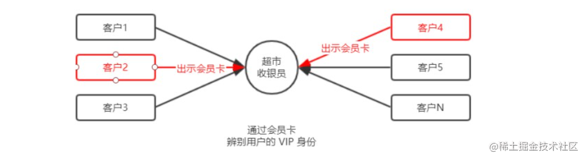
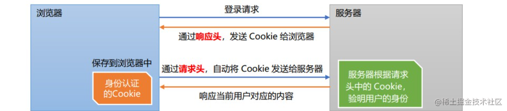
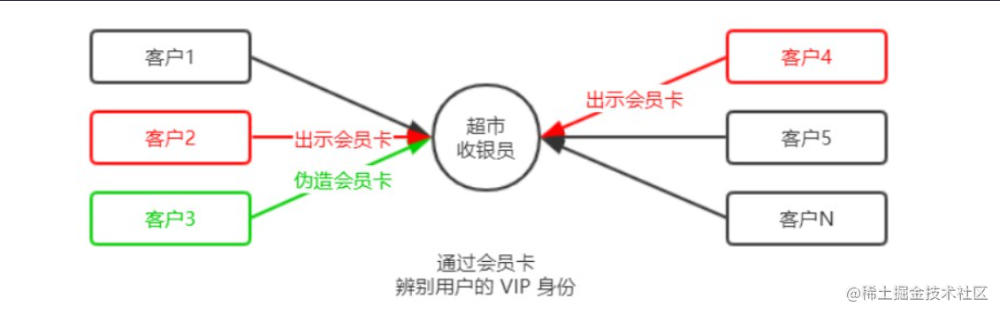
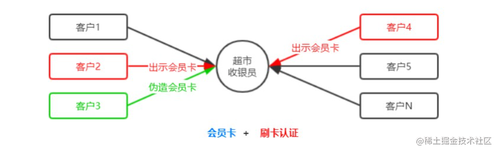
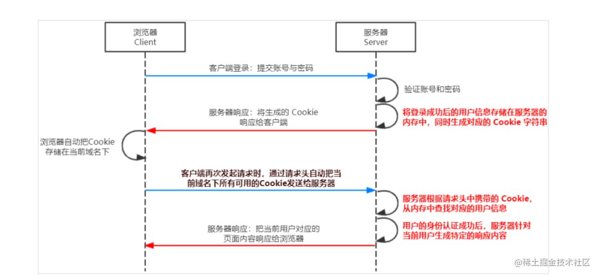

## 1. Web 开发模式
目前主流的 Web 开发模式有两种，分别是：
1. 基于<font color='red'>服务端渲染</font>的传统 Web 开发模式
2. 基于<font color='red'>前后端分离</font>的新型 Web 开发模式

## 2. 服务端渲染的 Web 开发模式
<font color='red'>服务端渲染的概念</font>：服务器<font color='047ffd'>发送给客户端的 HTML 页面</font>，是在<font color='red'>服务器通过字符串的拼接，动态生成的</font>。因此，客户端不需要使用 Ajax 这样的技术额外请求页面的数据。代码示例如下：
```js
app.get('/index.html', (req, res) => {
  // 1. 要渲染的数据
  const user = { name: 'zs', age: 22}
  // 2. 服务器通过字符串的拼接，动态生成 HTML内容
  const html = `<h1>姓名: ${user.name}，年龄: ${user.age}</h1>`
  // 3. 把生成好的页面内容响应给客户端。因此，客户端拿到的是带真实数据的 HTML 页面
  res.send(html)
})
```

## 3. 服务端渲染的优缺点
优点：
1. <font color='red'>**前端耗时少。**</font>因为服务器端负责动态生成 HTML 内容，浏览器只需要直接渲染页面即可。尤其是移动端，更省电。
2. <font color='red'>**有利于SEO。**</font>因为服务器端响应的是完整的 HTML 页面内容，所以爬虫更容易爬取获得信息，更有利于 SEO。

缺点：

3. <font color='red'>**占用服务器端资源。**</font>即服务器端完成 HTML 页面内容的拼接，如果请求较多，会对服务器造成一定的访问压力。

4. <font color='red'>**不利于前后端分离，开发效率低。**</font>使用服务器端渲染，则<font color='047ffd'>无法进行分工合作</font>，尤其对于<font color='047ffd'>前端复杂度高</font>的项目，不利于项目高效开发。

## 4. 前后端分离的 Web 开发模式
前后端分离的概念：前后端分离的开发模式，<font color='red'>依赖于 Ajax 技术的广泛应用</font>。简而言之，前后端分离的 Web 开发模式，
就是<font color='red'>后端只负责提供 API 接口，前端使用 Ajax 调用接口</font>的开发模式。

## 5. 前后端分离的优缺点
优点：

1. <font color='red'>**开发体验好。**</font>前端专注于 UI 页面的开发，后端专注于api 的开发，且前端有更多的选择性。

2. <font color='red'>**用户体验好。**</font>Ajax 技术的广泛应用，极大的提高了用户的体验，可以轻松实现页面的局部刷新。

3. <font color='red'>**减轻了服务器端的渲染压力。**</font>因为页面最终是在每个用户的浏览器中生成的。

缺点：
1. <font color='red'>**不利于 SEO。**</font>因为完整的 HTML 页面需要在客户端动态拼接完成，所以爬虫对无法爬取页面的有效信息。（解决方案：利用 Vue、React 等前端框架的 <font color='red'>**SSR**</font> （server side render）技术能够很好的解决 SEO 问题！）

## 6. 如何选择 Web 开发模式
<font color='red'>**不谈业务场景而盲目选择使用何种开发模式都是耍流氓。**</font>

* 比如企业级网站，主要功能是展示而没有复杂的交互，并且需要良好的 SEO，则这时我们就需要使用<font color='red'>服务器端渲染</font>；

* 而类似后台管理项目，交互性比较强，不需要考虑 SEO，那么就可以使用<font color='red'>前后端分离</font>的开发模式。

另外，具体使用何种开发模式并不是绝对的，为了<font color='red'>同时兼顾</font>了<font color='047ffd'>首页的渲染速度</font>和<font color='047ffd'>前后端分离的开发效率</font>，一些网站采用了
首屏服务器端渲染 + 其他页面前后端分离的开发模式。

## 7. 什么是身份认证
<font color='red'>身份认证</font>（Authentication）又称“身份验证”、“鉴权”，是<font color='red'>指通过一定的手段，完成对用户身份的确认</font>。

* 日常生活中的身份认证随处可见，例如：高铁的验票乘车，手机的密码或指纹解锁，支付宝或微信的支付密码等。

* 在 Web 开发中，也涉及到用户身份的认证，例如：各大网站的手机验证码登录、邮箱密码登录、二维码登录等。

## 8. 为什么需要身份认证
* 身份认证的目的，是为了<font color='red'>确认当前所声称为某种身份的用户，确实是所声称的用户</font>。例如，你去找快递员取快递，你要怎么证明这份快递是你的。

* 在互联网项目开发中，如何对用户的身份进行认证，是一个值得深入探讨的问题。例如，如何才能保证网站不会错误的将
“马云的存款数额”显示到“马化腾的账户”上。

## 9. 不同开发模式下的身份认证
对于<font color='red'>服务端渲染</font>和<font color='red'>前后端分离</font>这两种开发模式来说，分别有着不同的身份认证方案：

1. <font color='red'>服务端渲染</font>推荐使用 <font color='047ffd'>**Session 认证机制**</font>

2. <font color='red'>前后端分离</font>推荐使用 <font color='red'>**JWT 认证机制**</font>

## 10. Session 认证机制 - HTTP 协议的无状态性
了解 HTTP 协议的无状态性是进一步学习 Session 认证机制的必要前提。

HTTP 协议的无状态性，指的是客户端的<font color='047ffd'>每次 HTTP 请求都是独立的</font>，连续多个请求之间没有直接的关系，<font color='red'>服务器不会主动保留每次 HTTP 请求的状态</font>。

## 11. Session 认证机制 - 如何突破 HTTP 无状态的限制
对于超市来说，为了方便收银员在进行结算时给 VIP 用户打折，超市可以为每个 VIP 用户发放会员卡。



注意：现实生活中的会员卡身份认证方式，在 Web 开发中的<font color='047ffd'>专业术语</font>叫做 <font color='red'>**Cookie**</font>。

## 12. Session 认证机制 - 什么是 Cookie
Cookie 是<font color='red'>**存储在用户浏览器中的一段不超过 4 KB 的字符串**</font>。它由一个<font color='red'>名称</font>（Name）、一个<font color='red'>值</font>（Value）和其它几个用于控制 Cookie <font color='047ffd'>有效期、安全性、使用范围</font>的<font color='red'>可选属性</font>组成。

不同域名下的 Cookie 各自独立，每当客户端发起请求时，会<font color='red'>自动</font>把<font color='red'>当前域名下</font>所有<font color='red'>未过期的 Cookie</font> 一同发送到服务器。

<font color='red'>**Cookie的几大特性**</font>：
1. 自动发送
2. 域名独立
3. 过期时限
4. 4KB 限制

## 13. Session 认证机制 - Cookie 在身份认证中的作用
客户端第一次请求服务器的时候，服务器<font color='red'>通过响应头</font>的形式，向客户端发送一个身份认证的 Cookie，客户端会自动将 Cookie 保存在浏览器中。

随后，当客户端浏览器每次请求服务器的时候，浏览器会<font color='red'>自动</font>将身份认证相关的 Cookie，<font color='red'>通过请求头</font>的形式发送给服务器，服务器即可验明客户端的身份。



## 14. Cookie 不具有安全性
由于 Cookie 是存储在浏览器中的，而且**浏览器也提供了读写 Cookie 的 API**，因此 **Cookie 很容易被伪造**，不具有安全性。因此不建议服务器将重要的隐私数据，通过 Cookie 的形式发送给浏览器。



注意：**千万不要使用 Cookie 存储重要且隐私的数据**！比如用户的身份信息、密码等。

## 15. 提高身份认证的安全性
为了防止客户伪造会员卡，收银员在拿到客户出示的会员卡之后，可以**在收银机上进行刷卡认证**。只有收银机确认存在的会员卡，才能被正常使用。


这种“会员卡 + 刷卡认证”的设计理念，**就是 Session 认证机制的精髓**

## 16. Session 的工作原理



## 17. 安装 express-session 中间件
在 Express 项目中，只需要安装 <font color='047ffd'>express-session</font> 中间件，即可在项目中使用 Session 认证：
```js
npm i express-session
```

## 18. 配置 express-session 中间件
express-session 中间件安装成功后，需要通过 `app.use()` 来**注册 session 中间件**，示例代码如下：
```js
// TODO_01：请配置 Session 中间件
// 导入 session 中间件
const session = require('express-session')
// 配置 session 中间件
app.use(session({
  secret: 'itheima',      // secret 属性的值可以是任意字符串
  resave: false,          // 固定写法
  saveUninitialized: true // 固定写法
}))
```
## 19. 向 session 中存数据
当 express-session 中间件配置成功后，即可通过 `req.session` 来访问和使用 session 对象，从而存储用户的关键信息：
```js
// 登录的 API 接口
app.post('/api/login', (req, res) => {
  // 判断用户提交的登录信息是否正确
  if (req.body.username !== 'admin' || req.body.password !== '000000') {
    return res.send({ status: 1, msg: '登录失败' })
  }

  // TODO_02：请将登录成功后的用户信息，保存到 Session 中
  // 注意：只有成功配置了 epxress-session 这个中间件，才能使用 req.session
  req.session.user = req.body // 将用户信息，存储到 Session 中
  req.session.islogin = true  // 将用户的登录状态，存储到 Session 中

  res.send({ status: 0, msg: '登录成功' })
})
```

## 20. 从 session 中取数据
可以直接从 `req.session` 对象上获取之前存储的数据，示例代码如下：
```js
// 获取用户姓名的接口
app.get('/api/username', (req, res) => {
  // TODO_03：请从 Session 中获取用户的名称，响应给客户端
  // 判断用户是否登录
  if (!req.session.islogin) {
    return res.send({status: 1, msg: 'fail'})
  }
  // 如果已登录，发送用户姓名
  res.send({
    status: 0,
    msg: 'success',
    username: req.session.user.username
  })
})
```
## 21. 清空 session
调用 `req.session.destroy()` 函数，即可清空服务器保存的 session 信息。
```js
// 退出登录的接口
app.post('/api/logout', (req, res) => {
  // TODO_04：清空 Session 信息
  // 调用 req.session.destroy() 函数，即可清空服务器保存的 session 信息。
  req.session.destroy()
  res.send({
    status: 0,
    msg: '退出登录成功！'
  })
})
```

## 22. 完整代码
`app.js` 中
```js
// 导入 express 模块
const express = require('express')
// 创建 express 的服务器实例
const app = express()

// TODO_01：请配置 Session 中间件
// 导入 session 中间件
const session = require('express-session')
// 配置 session 中间件
app.use(session({
  secret: 'itheima',      // secret 属性的值可以是任意字符串
  resave: false,          // 固定写法
  saveUninitialized: true // 固定写法
}))

// 托管静态页面
app.use(express.static('./pages'))
// 解析 POST 提交过来的表单数据
app.use(express.urlencoded({ extended: false }))

// 登录的 API 接口
app.post('/api/login', (req, res) => {
  // 判断用户提交的登录信息是否正确
  if (req.body.username !== 'admin' || req.body.password !== '000000') {
    return res.send({ status: 1, msg: '登录失败' })
  }

  // TODO_02：请将登录成功后的用户信息，保存到 Session 中
  // 注意：只有成功配置了 epxress-session 这个中间件，才能使用 req.session
  req.session.user = req.body // 将用户信息，存储到 Session 中
  req.session.islogin = true  // 将用户的登录状态，存储到 Session 中

  res.send({ status: 0, msg: '登录成功' })
})

// 获取用户姓名的接口
app.get('/api/username', (req, res) => {
  // TODO_03：请从 Session 中获取用户的名称，响应给客户端
  // 判断用户是否登录
  if (!req.session.islogin) {
    return res.send({status: 1, msg: 'fail'})
  }
  // 如果已登录，发送用户姓名
  res.send({
    status: 0,
    msg: 'success',
    username: req.session.user.username
  })
})

// 退出登录的接口
app.post('/api/logout', (req, res) => {
  // TODO_04：清空 Session 信息
  // 调用 req.session.destroy() 函数，即可清空服务器保存的 session 信息。
  req.session.destroy()
  res.send({
    status: 0,
    msg: '退出登录成功！'
  })
})

// 调用 app.listen 方法，指定端口号并启动web服务器
app.listen(80, function () {
  console.log('Express server running at http://127.0.0.1:80')
})
```
***
> 每文一句：谁游乐无度，谁就没有功夫学习。
