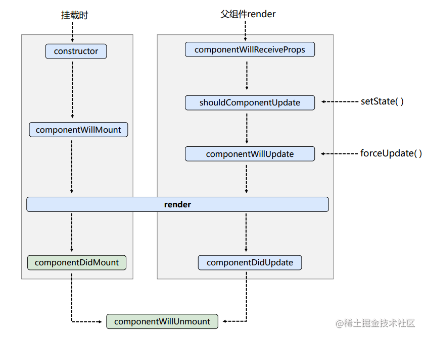
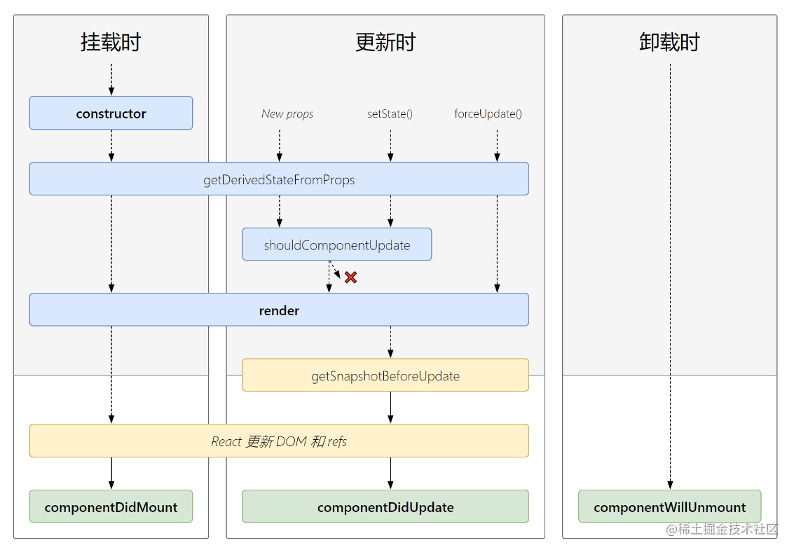

:::tip[前言]
本次整理了我学习react过程中的各部分的知识点，看完文本你将会学到
* jsx的基本使用
* 使用脚手架创建项目
* 如何在React当中定义组件
* React当中的事件绑定方式以及注意事项
* 关于react组件的三大核心属性及其运用
* React组件的生命周期

想深入学习的可以前往 [React官网](https://reactjs.org/)

:::
## 一、React初体验

**步骤**：准备一个容器、创建虚拟DOM、使用 **`ReactDOM.render()`** 方法渲染页面

**注意**：如果在html页面中使用 React，需要导入三个包。其中，`react.development.js` 必须在`react-dom.development.js`之前引入，下面为了方便，便不再引入。
```html
<head>
  <!-- 注意: 部署时，将 "development.js" 替换为 "production.min.js"。-->
  <script src="https://unpkg.com/react@16/umd/react.development.js"></script>
  <script src="https://unpkg.com/react-dom@16/umd/react-dom.development.js"></script>
  <script src="https://unpkg.com/babel-standalone@6/babel.min.js"></script>
</head>
</head>
<body>
  <!-- 准备一个容器 -->
  <div id="app"></div>

  <!-- 注意：此处必须写babel -->
  <script type="text/babel">
    // 1. 创建虚拟DOM
    const VDOM = <h1>Hello React</h1> 
    // 2. 渲染虚拟DOM到页面(虚拟DOM, 容器)
    ReactDOM.render(VDOM,document.getElementById('app'))
  </script>
</body>
```

注意：上面都是在一个html文件里面编写react，为了方便 jsx 的部分会在这里说明，其他的会在脚手架创建的项目中说明


## 二、虚拟DOM的两种创建方式

### 1. 使用纯 js 创建

```html
<body>
  <div id="app"></div>

  <script type="text/javascript">
    // 使用纯js创建虚拟DOM太繁琐，可读性差，不利于维护
    const VDOM = React.createElement('h1',{id:'title'},React.createElement('span',{},'Hello React'));
    ReactDOM.render(VDOM,document.getElementById('app'))
  </script>
</body>
```

### 2. 使用 jsx 创建

```html
<body>
  <!-- 准备一个容器 -->
  <div id="app"></div>

  <script type="text/babel">
    // 使用 jsx 创建虚拟DOM便捷高效
    const VDOM = (
      <h1 id="h1">
        <span>Hello React</span>  
      </h1> 
    )
    ReactDOM.render(VDOM,document.getElementById('app'))
  </script>
</body>
```

拓展：使用 jsx 创建的DOM最终会被转成 React element 元素，我们一般直接使用 jsx 即可

## 三、jsx 的基础学习 
### 1. 基本认识
1. jsx 全称：JavaScript XML
2. react定义的一种类似于XML的JS扩展语法: JS + XML本质是React.createElement(component, props, ...children)方法的语法糖
3. 作用: 用来简化创建虚拟DOM 
* 写法：` const VDOM = <h1>Hello JSX!</h1>`
* 注意1：它不是字符串, 也不是HTML/XML标签
* 注意2：它最终产生的就是一个JS对象

### 2. jsx 语法规则
  1. 虚拟DOM必须只有一个**根标签**
  2. 定义虚拟DOM时，不要写引号
  3. 标签中混入js表达式，或者凡是想动态指定id、class、style，标签内容时，要使用大括号 **{}**
    4. 样式的类型指定要使用 **className**，为了避开js里面的关键字class
    5. label 标签的 for 属性要写成 `htmlFor`
    6. 内联样式：要用 `style={{color:'blue',fontSize:'30px'}}` 的形式去写
  6. 标签必须**闭合**
  7. 关于标签首字母
* **若小写字母开头**，则将标签转为html中同名元素，若html中无该标签对应的同名元素，则报错
* **若大写字母开头**，react会去渲染对应的组件，若组件未定义，则报错
````html
<body>
  <div id="app"></div>

  <script type="text/babel">
    const myId = 'aTgUiGu'
    const myData = 'Hello React'

    const VDOM = (
      <div>
        <h2 id={myId.toLowerCase()} className="title">
          <span style={{color:'blue',fontSize:'30px'}}>{myData.toLowerCase()}</span>
        </h2>
        <input type='text'/>
        <!--能运行，但会报错，因为html并没有这个标签-->
        <good>123</good>
      </div>
    )
    ReactDOM.render(VDOM, document.getElementById('app'));
  </script>
</body>
````


## 四、渲染虚拟DOM

**语法：`ReactDOM.render(virtualDOM, containerDOM)`**
**作用**： 将虚拟DOM元素渲染到页面中的真实容器DOM中显示
**参数说明**
* 参数一: 纯 js 或 jsx 创建的虚拟 dom 对象
* 参数二: 用来包含虚拟 DOM 元素的真实 dom 元素对象(一般是一个div)


## 五、使用脚手架创建项目
### 1. 创建项目
```shell
create-react-app Hello
```
注意：需要提前全局安装 react 的脚手架 `npm i -g create-react-app`

### 2. 项目结构文件
    public ---- 静态资源文件夹
    	favicon.icon ------ 网站页签图标
    	index.html -------- 主页面
    	logo192.png ------- logo图
    	logo512.png ------- logo图
    	manifest.json ----- 应用加壳的配置文件
    	robots.txt -------- 爬虫协议文件
    src ---- 源码文件夹
    	App.css -------- App组件的样式
    	App.js --------- App组件
    	App.test.js ---- 用于给App做测试
    	index.css ------ 样式
    	index.js ------- 入口文件
    	logo.svg ------- logo图
    	reportWebVitals.js --- 页面性能分析文件(需要web-vitals库的支持)
    	setupTests.js ---- 组件单元测试的文件(需要jest-dom库的支持)

### 3. 自定义编写流程
1. 其中，最重要的是 src 目录下的 index.js 和 App.js 文件

	* **App.js 是程序的根组件**，建议其他组件都作为该组件的子组件
	* **index.js 是程序的入口文件**，主要编写挂载 App 组件的代码

2. 主要关注的是 index.js 的入口文件该如何编写，由于 React17 和 React18版本的写法有些许不同，以下列出各自的写法

React17
```js
import React from 'react'
import ReactDOM from 'react-dom'
import App from './App'

ReactDOM.render(<App/>, document.getElementById('root'))
```

React18
```js
import { createRoot } from "react-dom/client";
import App from './App'

const root = createRoot(document.getElementById('root'))
root.render(<App/>)
```


## 六、React 中定义组件的两种方式

### 1. 函数式组件

**创建函数式组建的注意事项：**
1. 函数名首字母必须**大写**

2. 函数必须要有 **return**

3. 使用 `ReactDOM.render()` 时，必须写成**标签形式**

4. 注意：经过babel编译（开启严格）后的函数，禁止了内部的 this 指向 window

```html
<body>
  <div id="app"></div>

  <script type="text/babel">
    // 创建函数式组件
    function MyComponent() {
      console.log(this);  // undefined
      return (
      	<h2>我是用函数定义的组件（使用于【简单组件】的定义）</h2>
      )
    }
    ReactDOM.render(<MyComponent/>, document.getElementById('app'))
  </script>
</body>
```
**拓展：执行了 ReactDOM.render() 之后，发生了什么？**
1. React解析组件标签，找到对应组件
2. 发现组件时函数式定义的，随后调用该函数
3. 将返回的虚拟DOM转为真实DOM，随后呈现在页面中

### 2. 类式组件

**创建类式组件的注意事项：**
1. 类名首字母必须**大写**
2. 使用类创建组件，必须继承 **React.Component** 父类
3. 类中必须要实现 **render** 方法，并且有 **return**
4. HTML标签首字母要小写，组件首字母要大写
4. 使用 ReactDOM.render() 时，必须写成**标签形式**
```html
<body>
  <div id="app"></div>

  <script type="text/babel">
    //  创建类式组件
    class MyComponent extends React.Component {
      render() {
        // render中的this是谁？ —— MyComponent的实例对象 <=> MyComponent组件实例对象
        console.log('render中的this',this); // MyComponent{}
        return <h2>我是用类定义的组件（使用于【复杂组件】的定义）</h2>
      }
    }
    ReactDOM.render(<MyComponent/>, document.getElementById('app'))
   
  </script>
</body>
```
**拓展： 执行了ReactDOM.render()之后，发生了什么？**
1. React解析组件标签，找到对应组件
2. 发现组件时类式定义的，随后**new出来该类的实例**，并**通过该实例调用到原型上的render方法**
3. 将返回的虚拟DOM转为真实DOM，随后呈现在页面中 


## 六、React 事件绑定的方式

**1. 通过onXxx属性指定事件处理函数(注意大小写)** 
* React 使用的是自定义(合成)事件, 而不是使用的原生DOM事件 —— 为了更好的兼容性
* React 中的事件是通过事件委托方式处理的(委托给组件最外层的元素) —— 更高效

**2. 通过event.target得到发生事件的DOM元素对象** —— 不要过度使用 ref

**3. 具体实现：**

**3.1 在类式组件中绑定事件**，React 推荐使用行内形式，例如：

```html
<button onClick={this.handleClick}>点击</button>
```

**3.2 然后在类中自定义回调函数，要用赋值语句的形式 + 箭头函数**。说明：
* 使用赋值的写法，这个方法就放在了实例自身；
* 由于使用了箭头函数，其内部的this指向就是外层作用域下的this（组件的实例对象，这样可以拿到实例上的属性值）

```html
<body>
  <div id="app"></div>

  <script type="text/babel">
    class Demo extends React.Component {

      // 失焦事件
      blurShowData = (e) => {
        // 这个 e 就是当前发生事件的 DOM 元素
        console.log(e.target);
        alert(e.target.value)
      }
      
      render() {
        // React推荐使用行内形式
        return (
          <div>
            <input onBlur={this.blurShowData} type="text" placeholder="表单失焦弹出数据"/>
          </div>
        )
      }
    }
    ReactDOM.render(<Demo/>, document.getElementById('app'))
  </script>
</body>
```

**4. 事件绑定中处理 this 的三种方案**

* 方案一: bind 绑定 this (显示绑定)
* 方案二: 定义函数时, 使用箭头函数
* 方案三(推荐): 直接传入一个箭头函数, 在箭头函数中调用需要执行的函数

```jsx
  <script type="text/babel">
    class App extends React.Component {
      constructor(props) {
        super(props);
        this.state = {
          message: "你好啊",
          counter: 100
        }
        // bind绑定this
        this.btnClick = this.btnClick.bind(this);
      }

      render() {
        return (
          <div>
            {/* 1.方案一: bind绑定this(显示绑定) */}
            <button onClick={this.btnClick}>按钮1</button>
            <button onClick={this.btnClick}>按钮2</button>
            <button onClick={this.btnClick}>按钮3</button>

            {/* 2.方案二: 定义函数时, 使用箭头函数 */}
            <button onClick={this.increment}>+1</button>

            {/* 2.方案三(推荐): 直接传入一个箭头函数, 在箭头函数中调用需要执行的函数*/}
            <button onClick={() => { this.decrement("why") }}>-1</button>
          </div>
        )
      }

      btnClick() {
        console.log(this.state.message);
      }

      // increment() {
      //   console.log(this.state.counter);
      // }
      // 箭头函数中永远不绑定this
      // ES6中给对象增加属性: class fields
      increment = () => {
        console.log(this.state.counter);
      }

      decrement(name) {
        console.log(this.state.counter, name);
      }
    }

    ReactDOM.render(<App/>, document.getElementById("app"));
  </script>
```


## 七、组件三大核心属性

### 1. state

**1.1 理解**

1. state 是组件实例上已经定义好的一个属性，初始值为 null
2. state 是组件对象最重要的属性, 值是 **对象** (可以包含多个 key-value 的组合)
3. 组件被称为 "状态机", 通过更新组件的 state 来更新对应的页面显示(重新渲染组件)

**1.2 state 的简单使用**

直接在组件类中，给state 赋值一个对象，往里面添加属性值即可

```html
<body>
  <div id="app"></div>

  <script type="text/babel">
    class Component extends React.Component {
      state = {
        msg: 'hello state'
      }
      render() {
        return <h1>{this.state.msg}</h1>
      }
    }
    ReactDOM.render(<Component/>, document.getElementById('app'))
  </script>
</body>
```

**1.3 如何修改state 中的值**

**使用**：必须调用 React 内置的 `setState()` 方法去修改state中的值，通过this 调用即可

**说明**：该 setState 在父类的 React.component 类身上，使用 this 顺着原型链就能找到

```html
<body>
  <div id="app"></div>

  <script type="text/babel">
    class Component extends React.Component {
      state = {
        msg: 'hello state'
      }
      changeMsg = () => {
        // 调用 setState 方法，更新数据
        this.setState({
          msg: 'hello React'
        })
      }
      render() {
        return <h1 onClick={this.changeMsg}>{this.state.msg}</h1>
      }
    }
    ReactDOM.render(<Component/>, document.getElementById('app'))
  </script>
</body>
```

**强烈注意**：

1. 组件中render方法中的this为组件实例对象
2. 组件自定义的方法中this为undefined，如何解决？
* 强制绑定this: 通过函数对象的bind()，，但是必须写在构造器中，这种写法不方便
```js
this.changeWeather = this.changeWeather.bind(this)
```
* 推荐使用的方式：**赋值语句的形式 + 箭头函数**
3. 状态数据，不能直接修改或更新，需要用到 **setState**

### 2. props - 组件通信-父传子

**2.1 理解**
1. 每个组件对象都会有 **props** (properties的简写) 属性
2. 组件标签的所有属性都保存在 props 中
3. **props 是只读的，不可修改**

**2.2 作用**
1. 通过标签属性从组件外向组件内**传递**变化的数据
2. **注意: 组件内部不要修改 props 数据**

**2.3 简单使用**

1. 第一种写法：将属性值直接写在组件标签上，
```js
ReactDOM.render(<Person name="张三" age={19}/>, document.getElementById('app'))
```
**注意**：如果要传递 number 类型数据，必须使用{}
2. 第二种写法：事先准备好一个数据对象，然后通过拓展运算符传递
```js
const data = {name:"张三", age:19}
ReactDOM.render(<Person {...data}/>, document.getElementById('app'))
```
**注意**：使用 this.props 获取数据时，属性名要与数据对象保持一致
**说明**：正常情况下是无法对一个对象直接使用拓展运算符的，是因为 babel + react.development.js 的加持下，才允许这么写，仅可以在组件标签中这么写
3. 从组件实例 this 上的 props 获取属性值
* `const { name, age } = this.props`

```html
<body>
  <div id="app"></div>

  <script type="text/babel">
    class Person extends React.Component {
      render() {
        // props 会接收到组件标签上的属性值
        const { name, age } = this.props
        return (
          <ul>
            <li>姓名：{name}</li>
            <li>年龄：{age}</li>
          </ul>
        )
      }
    }
    // 1. 将属性值只在写在组件标签上
    // ReactDOM.render(<Person name="张三" age="19"/>, document.getElementById('app'))

    // 2. 另一种写法，采用展开运算符
    const data = {name:"张三", age:19}
    ReactDOM.render(<Person {...data}/>, document.getElementById('app'))

  </script>
</body>
```

**2.4 对 props 进行限制**

1. 直接在类中添加 **static** 静态属性即可，必须使用 **propTypes**


2. 给传递的属性定义具体规则时，必须使用 **PropTypes** ，具体写法看下面示例
3. 如果想要指定属性值的默认值，必须使用 **defaultProps**

```html
<body>
  <div id="app"></div>
  <div id="app1"></div>
  <div id="app2"></div>

  <script type="text/babel">
    class Person extends React.Component {
      // 给 Person 添加静态属性，（给类自身添加属性）
      static propTypes = {
        name: PropTypes.string.isRequired, 
        age: PropTypes.number,             
        sex: PropTypes.string,             
        speak:PropTypes.func,              
      }
      // 指定默认值
      static defaultProps = {
        age: 18, 
        sex: '未知'
      }

      render() {
        const { name, age, sex } = this.props
        return (
          <ul>
            <li>姓名：{name}</li>
            <li>年龄：{age}</li>
            <li>性别：{sex}</li>
          </ul>
        )
      }
    }

    ReactDOM.render(<Person name="小明" age={19} sex="男"/>, document.getElementById('app'))
    ReactDOM.render(<Person name="小红" sex="女"/>, document.getElementById('app1'))
    ReactDOM.render(<Person name="小强" age={34}/>, document.getElementById('app2'))

  </script>
</body>
```

**注意**：如果在 html 页面对 props 进行限制，必须导入 ` prop-types.js ` 这个包

**2.5 在函数式组件使用 props**

```html
<body>
  <div id="app"></div>

  <script type="text/babel">
    // 接收 props，即可拿到标签属性的值
    function Person(props) {
      return (
        <ul>
          <li>姓名：{props.name}</li>
          <li>年龄：{props.age}</li>
        </ul>
      )
    }
    // 函数式组件对props的值进行限制，只能通过这种方式
    Person.propTypes = {
      name: PropTypes.string.isRequired, 
      age: PropTypes.number,             
    }
    Person.defaultProps = {
      age: 18,
    }
    ReactDOM.render(<Person name="jack"/>, document.getElementById('app'))
  </script>
</body>
```

### 3.子传父 

**核心原理**：父组件传递一个函数给子组件，子组件接收这个函数，调用时传递参数，父组件就能接收到参数。

### 4. refs

**理解**：组件内的标签可以定义 **ref** 属性来标识自己

**3.1 字符串形式的 ref**
1. react会收集添加了 ref 属性的元素
2. 通过 this.refs 就可拿到对应 ref 属性值的元素
> 注意：React 官方不推荐字符串这种形式的写法，“因为 string 类型的 refs 存在 一些问题。它已过时并可能会在未来的版本被移除。”

```html
<body>
  <div id="app"></div>

  <script type="text/babel">
    class Demo extends React.Component {
      // 点击事件
      clickShowData = () => {
        // 通过 this.refs 就可拿到对应 ref 属性值的元素
        const { input1 } = this.refs
        alert(input1.value)
      }
      render() {
        // 1. react会收集添加了 ref 属性的元素
        return (
          <div>
            <input ref="input1" type="text" placeholder="点击按钮弹出数据"/>&nbsp;
            <button onClick={this.clickShowData}>点击弹出左边的数据</button>
          </div>
        )
      }
    }
    ReactDOM.render(<Demo/>, document.getElementById('app'))
  </script>
</body>
```

**3.2 回调函数形式的 ref**
1. ref 为回调函数的形式，react 内部会调用定义的回调函数
```html
<input ref={c=>this.input1=c} type="text" />
```
回调函数里的含义是：把 ref 所在的节点挂载到组件的实例 this上，名字为 input1
2. 直接从组件实例 this 即可拿到节点元素
```html
<body>
  <div id="app"></div>

  <script type="text/babel">
    class Demo extends React.Component {
      // 点击事件
      clickShowData = () => {
        // 2. 直接从组件实例 this 拿到节点元素
        const { input1 } = this
        alert(input1.value)
      }
      render() {
        // 1. ref 为回调函数的形式，react 内部会调用
        // 回调函数里的含义是：把 ref 所在的节点挂载到组件的实例 this上，名字为 input1
        return (
          <div>
            <input ref={c=>this.input1=c} type="text" placeholder="点击按钮弹出数据"/>&nbsp;
            <button onClick={this.clickShowData}>点击弹出左边的数据</button>
          </div>
        )
      }
    }
    ReactDOM.render(<Demo/>, document.getElementById('app'))
  </script>
</body>
```

**3.3 createRef 的形式**
1. 使用 `React.createRef()` 的形式获取 DOM 元素，（直接把 inputRef 绑定到 组件实例 this上，直接 `this.inputRef.current` 可以获取）
2. createRef 调用后会返回一个容器，该容器可以存储被 ref 所标识的 DOM 元素，该容器是 "独一无二的"
3. 这也是 React 官方推荐的形式
```html
<body>
  <div id="app"></div>

  <script type="text/babel">
    class Demo extends React.Component {
      // 使用 React.createRef() 的形式获取 DOM 元素
      inputRef = React.createRef()
      // 点击事件
      clickShowData = () => {
        // 2. 直接从组件实例 this 拿到节点元素
        console.log(this);
        const  input  = this.inputRef.current;
        alert(input.value)
      }
      render() {
        return (
          <div>
            <input ref={this.inputRef} type="text" placeholder="点击按钮弹出数据"/>&nbsp;
            <button onClick={this.clickShowData}>点击弹出左边的数据</button>&nbsp;
          </div>
        )
      }
    }
    ReactDOM.render(<Demo/>, document.getElementById('app'))
  </script>
</body>
```
**3.4 总结**
* 一般用回调形式的 ref 就行了，比 ``React.createRef() 方便
* 拓展：jsx 中注释的写法：`{/* <div>哈哈哈</div> */}`

## 八、React 中收集表单数据
### 1. 非受控组件
**理解**：表单中所有输入类的组件，现用现取的就是非受控组件
```html
<body>
  <div id="app"></div>

  <script type="text/babel">
    class Login extends React.Component {
      // 展示输入数据
      showData = (e) => {
        e.preventDefault() // 阻止表单提交
        const {username, password} = this
        alert(`用户名：${username.value}，密码：${password.value}`)
      }
      
      render() {
        return (
          <form action="https://www.baidu.com" onSubmit={this.showData}>
            用户名<input ref={c=>this.username=c} type="text" name="username"/><br/>
            密码：<input ref={c=>this.password=c} type="password" name="password"/>  
            <button>提交</button>
          </form>
        )
      }
    }
    ReactDOM.render(<Login/>, document.getElementById('app'))
  </script>
</body>
```
**说明**：这里其实是通过 ref 获取当前DOM元素，就可以拿到输入的 value 值

### 2. 受控组件
**理解**：表单中所有输入类的组件，将值存进 **state** 维护，后面再使用的就叫受控组件
```html
<body>
  <div id="app"></div>

  <script type="text/babel">
    class Login extends React.Component {
      state = {
        username: '',
        password: ''
      }

      // 保存 username 到 state 中
      saveUsername = (e) => {
        this.setState({
          username: e.target.value
        })
      }

      // 保存 password 到 state 中
      savePassword = (e) => {
        this.setState({
          password: e.target.value
        })
      }

      // 展示输入数据
      showData = (e) => {
        e.preventDefault()
        const { username, password } = this.state
        alert(`用户名：${username}，密码：${password}`)
      }

      render() {
        return (
          <form action="https://www.baidu.com" onSubmit={this.showData}>
            用户名<input onChange={this.saveUsername} type="text" name="username"/><br/>
            密码：<input onChange={this.savePassword} type="password" name="password"/>  
            <button>提交</button>
          </form>
        )
      }
    }
    ReactDOM.render(<Login/>, document.getElementById('app'))
  </script>
</body>
```
**说明**：这里是监听了 input 的 **change** 事件，当内容发生变化，就会立即调用。然后会把最新值存入 **state** 中维护。

**注意**：这里的 change 事件分别写了两个函数，万一后面有更多的需要监听，会非常的繁琐。所以后面会使用 **函数柯里化** 进行优化。

### 3. 实现表单数据的双向绑定
```html
<body>
  <div id="app"></div>

  <script type="text/babel">
    class Demo extends React.Component {

      // 存放用户输入的数据
      state = {
        msg: ''
      }

      // 监听input的change事件，将数据存入state中
      saveMsg = (e) => {
        this.setState({
          msg: e.target.value
        })
      }

      render() {
        return (
          <div>
            <h2>实时显示你输入的数据：{this.state.msg}</h2>  
            <input onChange={this.saveMsg} type="text" placeholder="请输入"/>
          </div>
        )
      }
    }
    ReactDOM.render(<Demo/>, document.getElementById('app'))
  </script>
</body>
```
**说明**：这里是监听了 input 的 **change** 事件，然后将最新的数据存入 **state** 中，然后在 jsx 中展示


## 九、高阶函数-函数柯里化
1. **高阶函数**：如果一个函数符合下面2个规范中的任何一个，那该函数就是高阶函数
* 若A函数，**接收的参数是一个函数**，那么A就可以称为高阶函数
* 若A函数，调用之后的**返回值依然是一个函数**，那么A就可以称为高阶函数

2. **函数的柯里化**：通过函数调用继续返回函数的方法，实现多次接收参数最后统一处理的函数编码形式

使用函数柯里化的形式，可以优化一些回调函数的写法，比如上面代码中的非受控组件，不同的 input 元素定义一个不同的回调函数，当需要获取的数据项多了时，就会显得非常臃肿。此时，就可以函数柯里化就派上用场了，具体实现看如下实例：
```html
<body>
  <div id="app"></div>

  <script type="text/babel">
    class Login extends React.Component {

      state = {
        username: '',
        password: ''
      }

      // 保存表单数据到 state 中，这里就是高阶函数，并且实现了函数的柯里化
      saveFormData = (dataType) => {
        // 返回一个函数，给事件去调用
        // 当注册事件时，直接调用并参入参数，那么事件 e 就在 return 的函数参数里
        return (e) => {
          // 当接收一个变量作为对象的的键时，必须使用 []
          this.setState({
            [dataType]: e.target.value
          })
        }
      }

      // 展示输入数据
      showData = (e) => {
        e.preventDefault()
        const { username, password } = this.state
        alert(`用户名：${username}，密码：${password}`)
      }

      render() {
        return (
          <form action="https://www.baidu.com" onSubmit={this.showData}>
            用户名<input onChange={this.saveFormData('username')} type="text" name="username"/><br/>
            密码：<input onChange={this.saveFormData('password')} type="password" name="password"/>  
            <button>提交</button>
          </form>
        )
      }
    }
    ReactDOM.render(<Login/>, document.getElementById('app'))
  </script>
</body>
```
**说明**：
* 在给两个 input 的 change 事件定义的回调函数是同一个，区别是各自传入了不同的参数

* 在回调函数中，又返回了一个函数，给 onChange 调用。在返回的函数中就根据传入的参数，将数据存储在 state 中对应的属性身上

  ​


## 十. React 组件的生命周期（重点）
### 1. 组件的生命周期（旧）
* 先上张图压压惊



**生命周期的三个阶段（旧）**
1. **初始化阶段**: 由 ReactDOM.render() 触发---初次渲染
* constructor() — 初始化参数
* componentWillMount() — 组件将要挂载
* render() - 组件渲染
* **componentDidMount() — 组件挂载完毕（常用，一般做初始化的事：发送请求等）**

2. **更新阶段**: 由组件内部 this.setSate() 或父组件重新 render 触发
* shouldComponentUpdate() — 控制组件 state 更新的 "阀门"，组件是否应该更新 return true|false
* componentWillUpdate() — 组件将要更新
* render() — 组件渲染
* componentDidUpdate() — 组件更新完毕

3. **卸载组件**: 由ReactDOM.unmountComponentAtNode()触发
* componentWillUnmount() — 组件将要卸载（常用，一般用于收尾操作）

补充：componentWillReciveProps — 组件将要接收新的 props。注意，这里只有第二次接收才算...

### 2. 组件的生命周期（新）
* 先上张图压压惊


**生命周期的三个阶段（新）**
1. 初始化阶段: 由ReactDOM.render()触发---初次渲染
* constructor()
* **getDerivedStateFromProps** — 会在调用 render 方法之前调用，并且在初始挂载及后续更新时都会被调用。
* render()
* componentDidMount()

2. 更新阶段: 由组件内部this.setSate()或父组件重新render触发
* **getDerivedStateFromProps**
* shouldComponentUpdate()
* render()
* **getSnapshotBeforeUpdate** — 在最近一次渲染输出（提交到 DOM 节点）之前调用
* componentDidUpdate()

3. 卸载组件: 由ReactDOM.unmountComponentAtNode()触发
* componentWillUnmount()


### 3. 将要废弃的生命周期函数
1. componentWillMount
2. componentWillReceiveProps
3. componentWillUpdate

**注意**：现在使用会出现警告，下一个大版本需要加上 **UNSAFE_** 前缀才能使用，以后可能会被彻底废弃，不建议使用。


## 十一、DOM 的 diff算法
### 1. 经典面试题:
1. react/vue中的key有什么作用？（key的内部原理是什么？）
2. 为什么遍历列表时，key最好不要用index?

### 2. 虚拟DOM中key的作用：
1). **简单的说**: **key 是虚拟 DOM 对象的标识**, 在更新显示时 key 起着极其重要的作用。

2). **详细的说**: 当状态中的数据发生变化时，react会根据【新数据】生成【新的虚拟DOM】,随后React进行【新虚拟DOM】与【旧虚拟DOM】的diff比较，比较规则如下：

```
a. 旧虚拟DOM中找到了与新虚拟DOM相同的key：
      (1).若虚拟DOM中内容没变, 直接使用之前的真实DOM
      (2).若虚拟DOM中内容变了, 则生成新的真实DOM，随后替换掉页面中之前的真实DOM

b. 旧虚拟DOM中未找到与新虚拟DOM相同的key
      根据数据创建新的真实DOM，随后渲染到到页面
```

### 3. 用index作为key可能会引发的问题：
**1. 若对数据进行：逆序添加、逆序删除等破坏顺序操作:** 会产生没有必要的真实DOM更新 ==> 界面效果没问题, 但效率低。

**2. 如果结构中还包含输入类的DOM：** 会产生错误DOM更新 ==> 界面有问题。

**3. 注意！** 如果不存在对数据的逆序添加、逆序删除等破坏顺序操作，仅用于渲染列表用于展示，使用index作为key是没有问题的。


## 十三、消息订阅发布-组件通信-任意组件

### 1. 作用

适用于任意组件间的通信，这里使用 [PubSub-js](https://github.com/mroderick/PubSubJS) 第三方库实现订阅发布

### 2. 安装

```shell
yarn add pubsub-js
```

### 3. 使用

**说明**：以下伪代码在类式组件中运行

**publish() 发布，用于发送数据**，一般在某个事件的回调函数中使用

```jsx
import PubSub from 'pubsub-js'

// PubSub.publish(发布名称, 数据)
PubSub.publish('coder', {name: 'bin', age: 21})
```

**subscribe() 订阅，用于接收数据**，一般在 `componentDidMount` 生命周期函数中执行

```jsx
import PubSub from 'pubsub-js'

// 要在组件挂载完后开始订阅
componentDidMount() {
    // PubSub.subscribe(发布名称, 回调函数)
    this.token = PubSub.subscribe('coder', (msg, data) =>{
        console.logI(msg)	// coder（这个msg没啥用，但必须写，否则报错，人家就这么设计）
        console.log(data)	// {name: 'bin', age: 21}
    })
}
```

**unsubscribe()，用于取消订阅**，谁订阅，谁取消，一般在 `componentWillUnmount` 生命周期中执行

```jsx
// 组件将要卸载时，取消订阅
componentWillUnmount() {
    PubSub.unsubscribe(this.token)	// 值为订阅时的返回值
}
```

> 每文一句：世界上三种东西最宝贵——知识、粮食和友谊。

