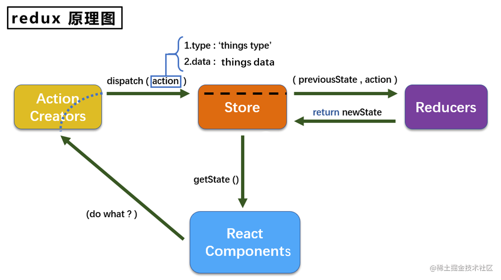
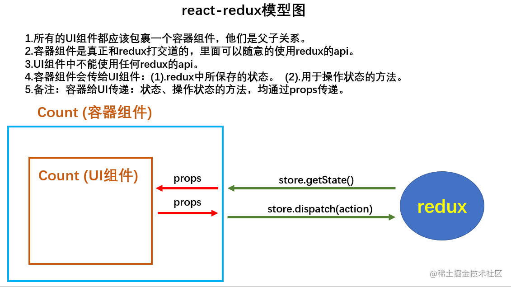

import { FileTree } from '@astrojs/starlight/components';

:::tip[前言]
本文将给大家带来redux和react-redux的快速使用，以理论+代码+案例的形式教大家如何在react中去使用状态管理，以实现数据的高效通信🚀

如果本文有不对、疑惑的地方，欢迎在评论区留言指正🌻

**长文预警**： 本文文字代码较多，请耐心观看，相信你会有所收获🍺
:::

## 一、什么是 redux
`Redux` 是 `JavaScript` 状态容器，提供可预测化的状态管理。可以理解为全局数据状态管理工具，用来做组件通信等。

## 二、为什么使用 redux
当没有使用 `redux` 时兄弟组件间传值将很麻烦，代码很复杂冗余。使用 `redux` 定义全局单一的数据 `Store`，可以自定义 `Store` 里面存放哪些数据，整个数据结构也是自己清楚的。

## 三、安装 redux
```shell
yarn add redux -S 
```

## 四、redux 工作流程
直接上图



## 五、redux的三个核心概念

### 1. action 数据更新的指令

1. 动作的对象
2. 包含2个属性
   * type：标识属性, 值为字符串, 唯一, 必要属性 
   * data：数据属性, 值类型任意, 可选属性

3. 例子：`{ type: 'ADD_STUDENT['](),data:{name: 'tom',age:18}}`

### 2. reducer 操作状态的纯函数

1. 用于初始化状态、加工状态
2. 加工时，根据旧的 state 和 action， 产生新的 state 的**纯函数**。

### 3. store 推送数据的仓库

1. 将 state、action、reducer 联系在一起的对象

2. 如何得到此对象?
```jsx
// 引入 legacy_createStore 用于创建 store
import { legacy_createStore as createStore } from "redux";

// 引入 reducer
import count_reducer from './reducer'

// 创建 store 并暴露
export default createStore(reducer)
```

3. 此对象的功能?
	* **getState()**: 得到state
	* **dispatch(action)**: 分发action, 触发reducer调用, 产生新的state
	* **subscribe(listener)**: 注册监听, 当产生了新的state时, 自动调用


## 六、 redux 的核心API

**1. createstore()**

作用：创建包含指定reducer的store对象

**2. store对象**

1. 作用: redux 库最核心的管理对象
2. 它内部维护着：state、reducer

**3. 核心方法**

* getState() - 获取数据
* dispatch(action) - 派发通知改变数据
* subscribe(listener) - 监听 redux 中状态的变化，只要一发生变化，就调用 render

**4. applyMiddleware()**

作用：应用上基于redux的中间件(插件库)

**5. combineReducers()**

作用：合并多个reducer函数


## 七、redux 的三大原则
### 1. 单一数据源

* 整个应用程序的 state 被存储在一颗 object tree 中, 并且这个 object tree 只存储在一个 store
* Redux 并没有强制让我们不能创建多 个Store，但是那样做并不利于数据的维护
* 单一的数据源可以让整个应用程序的state变得方便维护、追踪、修改


### 2. State是只读的

* **唯一修改 state 的方法一定是触发 action**, 不要试图在其它的地方通过任何的方式来修改 state
* 这样就确保了 View 或网络请求都不能直接修改 state，它们只能**通过 action 来描述自己想要如何修改 state**
* 这样可以保证所有的修改都被集中化处理，并且按照严格的顺序来执行，所以不需要担心 race condition (竟态)的问题


### 3. 使用纯函数来执行修改

* 通过 reducer 将旧 state 和 action 联系在一起, 并且返回一个新的 state
* 随着应用程序的复杂度增加，我们可以将 reducer 拆分成多个小的 reducers，分别操作不同 state tree 的一部分
* 但是所有的 reducer 都应该是纯函数，不能产生任何的副作用


## 八、redux 使用步骤

### 1.  基本流程

**(1) 创建reducer**

- 可以使用单独的一个 reducer,也可以将多个reducer合并为一个 reducer，即：`combineReducers()`
- action 发出命令后将 state 放入 reucer 加工函数中，返回新的 state ,对 stat e进行加工处理

**(2) 创建action**
- 用户是接触不到 state 的，只能有 view 触发，所以，这个 action 可以理解为指令，需要发出多少动作就有多少指令
- action 是一个对象，必须有一个叫 type 的参数，定义 action 类型

**(3) 创建的store，使用 legacy_createStore 方法**

- store 可以理解为有多个加工机器的总工厂
- 提供 subscribe，dispatch，getState 这些方法。


### 2. 下面用 redux 编写计数器的案例（异步action版）

**注意**：大部分注释都在代码中，小部分会另做说明

**src 有以下文件**
<FileTree>
- component
	- Count
		- index.jsx
- redux
	- constant.js
	- count_action.js
	- count_reducer.js
	- store.js
- App.jsx
- index.js
</FileTree>

**具体代码实现：**

`redux/constant.js`，
该模块用于定义 action 对象中 type 类型的常量值，方便维护，防止写错单词
```jsx
// ! 该模块用于定义 action 对象中 type 类型的常量值，方便维护，防止写错单词

// 加法的常量
export const INCREMENT = 'increment'  
```

``redux/count_aciton.js``，该文件专门为 Count 组件生成 action 对象
```js
// !该文件专门为 Count 组件生成 action 对象

// 引入type 类型的常量
import { INCREMENT } from './constant.js'

// 定义 action 
export const incrementAction = data => ({ type: INCREMENT, data})

// 异步 action，就是指 action 的值为函数，异步 action 中一般会调用同步 action，异步 action不是必须要用的
export const incrementAsyncAction = (data, time) => {
  // store的dispatch方法会判断 传入值是函数还是对象，如果是函数，那就给这个函数传参数，
  // 参数是store的dispatch方法并且执行这个函数
  return (dispatch) => {
    setTimeout(() => {
      dispatch(createIncrementAction(data))
    }, time)
  }
}
```
``reduce/count_reducer.js``，该文件用于创建一个为 Count 组件服务的 reducer
```js
/**
 * ! 1. 该文件用于创建一个为 Count 组件服务的 reducer，reducer 的本质就是一个函数
 * * 2. reducer 函数会接收到两个参数，分别为：之前的状态(perState)，动作对象(action)
 * * 3. reducer 其实就是用于初始化数据，操作数据的逻辑的函数
 */

// 引入常量
import { INCREMENT } from './constant.js'

// 初始化状态
const initState = 0;

// 定义 reducer 并暴露出去
export default function countReducer(preState = initState, action) {
  // 获取type，data
  const { type, data } = action 
  switch (type) {
    case INCREMENT: // 如果是加
      return preState + data
    default:
      return preState;
  }
}
```

``reduce/store.js``，该文件用于创建 store 对象

**注意**: redux-thunk 需要安装  `yarn add --save redux-thunk`
```js
// 引入 redux-thunk，用于支持异步 action
import thunk from 'redux-thunk'
// redux-thunk 是个中间件，必须引入 applyMiddleware
import { legacy_createStore as createStore, applyMiddleware } from "redux";
// 引入 reducer
import count_reducer from './count_reducer'

// 安装中间件 applyMiddleware(thunk)
export default createStore(count_reducer, applyMiddleware(thunk))
```


`component/Count/index.jsx`

```jsx
import React, { Component } from 'react'
import store from '../../redux/store'

// 引入action
import { incrementAction, incrementAsyncAction } from '../../redux/count_action'

/**
 * store 的几个 API
 * store.getState() 获取状态的数据
 * store.dispatch() 通知 reduce 更新状态，参数是个对象
 * store.subscribe() 监听状态发生变化则执行的回调
 */

export default class Count extends Component {

  // 如何调用 render？
  // 第一种方法：在组件挂载完成之后，调用 subscribe() API，调用更新state的方法，this.setState({})
  componentDidMount() {
    // 检测 redux 中状态的变化，只要一发生变化，就调用 render
    store.subscribe(() => {
      this.setState({})
    })
  }

  // 加法
  increment = () => {
    store.dispatch(incrementAction(1))
  }

   // 异步加
  incrementAsync = () => {
    const { value } = this.selectNumber
    setTimeout(() => {
      store.dispatch(incrementAsyncAction(1))
    }, 500);
  }
  
  render() {
    return (
      <div>
        <h1>当前求和为：{store.getState()}</h1>
        <button onClick={this.increment}>+</button>&nbsp;
        <button onClick={this.incrementAsync}>异步加</button>
      </div>
    )
  }
}

```

**App.jsx**

```jsx
import React, { Component } from 'react'
import Count from './components/Count'

export default class App extends Component {
  render() {
    return (
      <div>
        <Count/>
      </div>
    )
  }
}

```

**index.js**

```js
import { createRoot } from 'react-dom/client'
import App from './App'
import store from './redux/store'

const root = createRoot(document.getElementById('root'))
root.render(<App />)

// 第二种方法：在状态发生变化则执行的回调中，重新渲染App
store.subscribe(() => {
  root.render(<App/>)
})
```

### 3. 总结

1. **redux/constant.js** - 提供 type 常量
2. **redux/count_action.js** - 相当于指令，可以通过 `store.dispatch(action(data))` 通知 reduce 更新状态
3. **redux/count_reducer.js** - 初始化数据，操作数据的逻辑的函数
4. **redux/store.js** - 维护状态

## 九、安装 react-redux

```shell
yarn add react-redux
```

## 十、什么是 react-redux？

* `react-Redux` 是 `Redux`的官方 `React` 绑定库。它能够使你的 `React` 组件从 `Redux store` 中读取数据，并且向 `store ` 分发 `actions` 以更新数据
* 简单地说，就是专门用来简化 react 应用中使用 redux

**看图说话**




## 十一、react-Redux 将所有组件分成两大类

### 1. UI 组件
* 负责 UI 的呈现，不带有任何业务逻辑
* 通过props接收数据(一般数据和函数)
* 不使用任何 Redux 的 API
* 一般保存在 components 文件夹下

### 2. 容器组件 
* 负责管理数据和业务逻辑，不负责UI的呈现
* 使用 Redux 的 API
* 一般保存在containers 文件夹下


## 十二、react-redux 的两个核心

### 1. Provider

**说明：** Provider 是顶级组件，一般我们都将顶层组件包裹在 Provider 组件之中，这样的话，所有组件就都可以在react-redux的控制之下了，**但是 store 必须作为参数放到 Provider 组件中去**

**index.js 文件中**

```jsx
import { createRoot } from 'react-dom/client'
import App from './App'
// 引入 Provider 组件
import { Provider } from 'react-redux'
// 引入 store
import store from './redux/store'

const root = createRoot(document.getElementById('root'))
root.render(
  // * 优化一：在整个应用里面，但凡需要 store 的容器组件，Provider 组件都会传递过去
  // * 使用 Provider 包裹 App，目的是让 App所有的后代容器组件都能接收到 store
  <Provider store={store}>
    <App />
  </Provider>
)
```


### 2. connect

**说明：** 用于包装 UI 组件生成容器组件

```jsx
// 引入 connect 用于连接 UI 组件与 redux
import { connect } from 'react-redux'

// 使用 connect()() 创建并暴露一个 Count 的容器组件
export default connect(
    mapStateToProps, 
    mapDispatchToProps
)(MyComponent)
```

#### 2.1 mapStateToProps

**说明：** 这个单词翻译过来就是**把 state 映射到 props 中去** ,其实也就是**把 Redux 中的数据映射到 React 中的props中去。**

```jsx
// 1. mapStateToProps 函数返回的是一个对象
// 2. 函数返回的对象中的属性值，就作为传递给UI组件props的属性值
// 3. mapStateToProps 用于传递 '状态'
// 默认接收一个 state 参数，值为 count_reducer 里面初始化的值
function mapStateToProps(state) {
  // 这里传递了 count，所以UI组件接收的就是：this.props.count
  return {count: state}
}
```

#### 2.2 mapDispatchToProps

**说明：** 这个单词翻译过来就是就是**把各种 dispatch 也变成了 props 让你可以直接使用**

```jsx
import {
  incrementAction,
} from '../../redux/count_action'

// 1. 操作状态的方法
// 2. mapDispatchToProps 函数返回的是一个对象
// 3. 函数返回的对象中的属性值，就作为传递给UI组件props的属性值
// 4. mapStateToProps 用于传递 '操作状态的方法'
// 默认接收 dispatch 方法
function mapDispatchToProps(dispatch) {
  // 这里传递了 increment，所以UI组件接收的就是：this.props.increment(data)
  return {
    // 这里可以接收到的参数，为调用是传递的数据
    increment: number => dispatch(incrementAction(number)),
  }
}
```

### 3. connect 的简写

直接将  `mapStateToProps`,  `mapDispatchToProps` 写在 connect 里面

```jsx
import React, { Component } from 'react'
// 引入 connect 用于连接 UI 组件与 redux
import { connect } from 'react-redux'
// 引入action
import { increment } from '../../redux/actions/count.js'

// 1. 定义 UI 组件
class Count extends Component {
    ...
}
    
// 2. 使用 connect()() 创建并暴露一个 Count 的容器组件
export default connect(
  // 映射状态，state 就是 react-redux保存的状态
  // state.count: 这个 count 是 store.js 中，汇总 reducer 时定义的 key
  state => ({
    count: state.count,
  }),
  
  // mapDispatchToProps 的简写
  {
    // 直接映射 action，react-redux 会帮你 dispatch
    increment,
    decrement,
    incrementAsync
  }
)(Count)
```


## 十三、react-redux 求和案例

**说明：** 该案例是 redux 搭配 react-redux 实现的一个求和的简单需求，实现了两个组件间的数据共享（请查看代码中注释进行理解）

### 1. src 文件结构

<FileTree>
- containers
	- Count
		- index.jsx
	- Person
		- index.jsx
- redux
  - actions
    - count.js
    - person.js
  - reducers
    - count.js
    - person.js
    - index.js
  - constant.js
  - store.js
- App.jsx
- index.js
</FileTree>

### 2. redux 文件夹

**2.1 constant.js**

```js
// !该模块用于定义 action 对象中 type 类型的常量值
// count
export const INCREMENT = 'increment'  

// person
export const ADD_PERSON = 'add_person'
```


**2.2 actions/count.js**

```js
// !该文件专门为 Count 组件生成 action 对象

// 引入常量
import { INCREMENT, DECREMENT} from '../constant'

// 加法action
export const increment = data => ({ type: INCREMENT, data })

```

**actions/person.js**

```js
// 引入 type 常量
import { ADD_PERSON } from '../constant'

// 定义 action 并导出
export const addPerson = personObj => ({type: ADD_PERSON , data: personObj})
```


**2.3 reducers/count.js**

```js
// 引入常量
import { INCREMENT } from '../constant'

// 初始化状态
const initState = 0;
export default function countReducer(preState = initState, action) {
  // 获取type，data
  const { type, data } = action 
  switch (type) {
    case INCREMENT: // 如果是加
    default:
      return preState;
  }
}
```

**reducers/person.js**

```js
// 引入 type 常量
import { ADD_PERSON } from '../constant'

// 初始化状态
const initState = [{id: '001', name: 'coderbin', age: 18}]

// 定义 reducer，并暴露出去
export default function personReducer(preState = initState, action) {
  const { type, data } = action

  switch (type) {
    // 如果是添加一个人，就执行相关的逻辑操作
    case ADD_PERSON:
      // ! 不可写下面这一行代码，这样会导致 preState 被改写，personReducer 就不是纯函数了
      // preState.unshift(data)
      // 注意：只有返回的是一个新数组，react才会进行渲染，更新页面 
      return [data, ...preState]
  
    default:
      return preState
  }
}

```

**reducers/index.js**  统一在这里导出总 reducer

```js
// !该文件用于汇总所有的 reducer 为一个总的 reducer

// 引入 reducer
import count from './count.js'
import persons from './person.js'

// 引入 combineReducers，进行汇总
import { combineReducers } from "redux";

// * 使用 combineReducers() 汇总所有的 reducer，变成一个总的 reducer
export default combineReducers({
  count,
  persons
})

```

**2.4 store.js**

```js
// ! 该文件用于创建一个 react-redux 仓库

// 引入 redux-thunk，用于支持异步 action
import thunk from 'redux-thunk'
// redux-thunk 是个中间件，必须引入 applyMiddleware
import { legacy_createStore as createStore, applyMiddleware } from "redux";
// 引入 redux-devtools-extension
import { composeWithDevTools } from 'redux-devtools-extension'

// 引入汇总后的 reducer
import allReducer from '../redux/reducers/index.js'

// 创建一个 store 并导出
// composeWithDevTools 用于激活 redux 开发者工具
// 安装中间件 applyMiddleware(thunk)
export default createStore(allReducer, composeWithDevTools(applyMiddleware(thunk)))
```

**注意：** redux-devtools-extension 是 redux的开发者工具库，需要安装

```shell
yarn add redux-devtools-extension
```

### 3. containers 文件夹

**Count/index.jsx**

```jsx

import React, { Component } from 'react'
// 引入 connect 用于连接 UI 组件与 redux
import { connect } from 'react-redux'
// 引入action
import {
  increment,
  decrement,
  incrementAsync
} from '../../redux/actions/count.js'

// 1. 定义 UI 组件
class Count extends Component {

  // 加法
  increment = () => {
    const { value } = this.selectNumber
    // 调用 props 里面的方法，进行加减
    this.props.increment(Number(value))
  }

  render() {
    const { count } = this.props
    return (
      <div>
        <h1>我是Count组件</h1>
        <h3>当前求和为：{count}</h3>
        <h2>【拿到Person组件数据：总人数为: { this.props.persons.length}】</h2>
        <button onClick={this.increment}>+</button>
      </div>
    )
  }
}


// 2. 使用 connect()() 创建并暴露一个 Count 的容器组件
export default connect(
  // 映射状态，state 就是 react-redux保存的状态
  state => ({
    count: state.count,
    persons: state.persons
  }),
  {
    // 直接映射 action，react-redux 会帮你 dispatch
    increment,
    decrement,
    incrementAsync
  }
)(Count)
```

**Person/index.jsx**

```jsx
import React, { Component } from 'react'
import { nanoid } from 'nanoid'
import { connect } from 'react-redux'
import { addPerson } from '../../redux/actions/person.js'

class Person extends Component {
  // 添加
  addPerson = () => {
    const name = this.nameRef.value.trim()
    const age = Number(this.ageRef.value.trim())
    if(!name || !age) return alert('请输入！')
    const personObj = { id: nanoid(), name, age }
    this.props.addPerson(personObj)
    this.nameRef.value = ''
    this.ageRef.value = ''
  }

  render() {
    return (
      <div>
        <h1>我是Person组件</h1>
        <h2>【拿到Count组件的数据：求和为: { this.props.count}】</h2>
        <input ref={c=>this.nameRef=c} type="text" placeholder='请输入姓名'/>
        <input ref={c=>this.ageRef=c} type="text" placeholder='请输入年龄' />
        <button onClick={this.addPerson}>添加</button>
        <ul>
          {
            this.props.persons.map(item => {
              return <li key={item.id}>{ item.name} -- { item.age }</li>
            })
          }
        </ul>
      </div>
    )
  }
}

export default connect(
  // 当前组件需要什么数据（状态），就从这里映射什么数据（状态）
  state => ({
    persons: state.persons,
    count: state.count
  }),
  { addPerson }
)(Person)
```

### 4. App.jsx

```jsx
import React, { Component } from 'react'
// 引入容器组件
import Count from './containers/Count' 
import Person from './containers/Person'

export default class App extends Component {
  render() {
    return (
      <div>
        <Count/>
        <hr />
        <Person/>
      </div>
    )
  }
}

```

### 5. index.js

```jsx
import { createRoot } from 'react-dom/client'
import App from './App'
// 引入 Provider 组件
import { Provider } from 'react-redux'
// 引入 store
import store from './redux/store'

const root = createRoot(document.getElementById('root'))
root.render(
  <Provider store={store}>
    <App />
  </Provider>
)
```

### 6. 总结

在使用 **react-redux** 前，要先编写 redux 的内容，然后再去完成 UI 组件

UI组件的编写步骤
```
(1).定义好UI组件---不暴露

(2).引入connect生成一个容器组件，并暴露，写法如下：

   connect(
		state => ({key:value}), //映射状态
		{key:xxxxxAction} //映射操作状态的方法
	)(UI组件)

(4).在UI组件中通过this.props.xxxxxxx读取和操作状态
```


## 十四、纯函数和高阶函数

### 1. 纯函数

1. 一类特别的函数: 只要是同样的输入(实参)，必定得到同样的输出(返回)
2. 必须遵守以下一些约束
   * 不得改写参数数据
   * 不会产生任何副作用，例如网络请求，输入和输出设备
   * 不能调用 `Date.now()` 或者 `Math.random()` 等不纯的方法
3. redux的reducer函数必须是一个纯函数

### 2. 高阶函数
1. 理解: 一类特别的函数
   * 情况一：参数是函数
   * 情况二：返回值是函数
2. 常见的高阶函数
   * 定时器回调函数
   * 数组的 forEach()/map()/filter()/reduce()/find()/bind()
   * Promise
   * react-redux 中的 connect 函数
3. 作用: 能实现更加动态, 更加可扩展的功能

> 每文一句：虚假的学问比无知更糟糕。无知好比一块空地，可以耕耘和播种；虚假的学问就象一块长满杂草的荒地，几乎无法把草拔尽。
