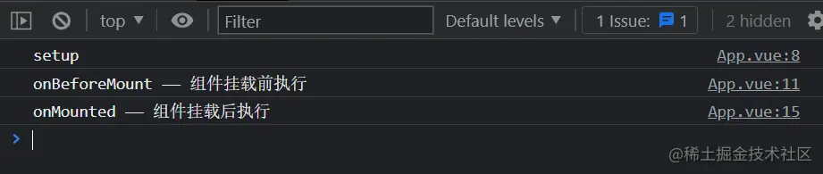
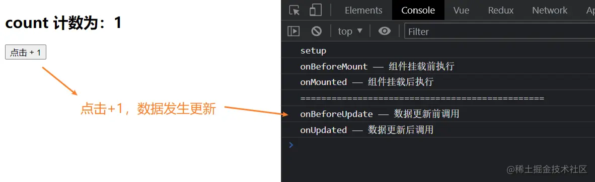
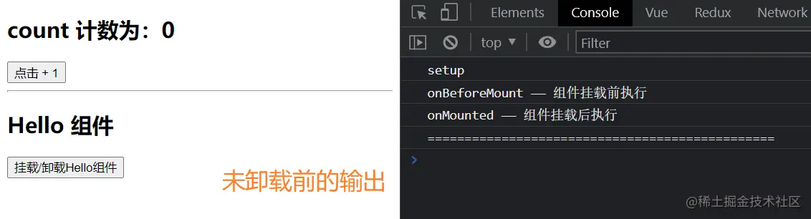
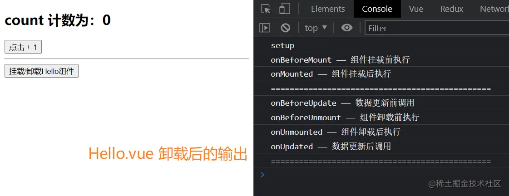

:::tip[前言]
每个 Vue 组件实例在创建时都需要经历一系列的初始化步骤，比如设置好数据侦听，编译模板，挂载实例到 DOM，以及在数据改变时更新 DOM。在此过程中，它也会运行被称为生命周期钩子的函数，让开发者有机会在特定阶段运行自己的代码。
:::

## 0. 生命周期图示

* 以下将在 vite 创建的工程中，举例说明生命周期函数
* `beforecate`和`created`，它们已经被`setup`方法本身所取代
* 以下钩子都应该在组件的 `setup()` 阶段被同步调用


## 1. onBeforeMount()
**作用**：**在组件被挂载之前被调用。**（获取不到 DOM 元素）

**描述**：当这个钩子被调用时，组件已经完成了其响应式状态的设置，但还没有创建 DOM 节点。它即将首次执行 DOM 渲染过程。

## 2. onMounted()
**作用**：**在组件挂载完成后执行。**（获取到了 DOM 元素）

**描述**：组件在以下情况下被视为已挂载：
* 其所有同步子组件都已经被挂载 (不包含异步组件或 `<Suspense>` 树内的组件)。
* 其自身的 DOM 树已经创建完成并插入了父容器中。注意仅当根容器在文档中时，才可以保证组件 DOM 树也在文档中。

这个钩子通常用于执行需要访问组件所渲染的 DOM 树相关的副作用，或是在[服务端渲染应用](https://staging-cn.vuejs.org/guide/scaling-up/ssr.html)中用于确保 DOM 相关代码仅在客户端执行。一般在这里进行数据网络请求操作


以上钩子的代码示例：
```html
<script setup>
import { onBeforeMount, onMounted } from "vue";

console.log('setup')

onBeforeMount(() => {
  console.log('onBeforeMount —— 组件挂载前执行')
})

onMounted(() => {
  console.log('onMounted —— 组件挂载后执行')
})

</script>
```
输出


## 3. onBeforeUpdate()
**作用**：**在组件即将因为响应式状态变更而更新其 DOM 树之前调用。**

**描述**：这个钩子可以用来在 Vue 更新 DOM 之前访问 DOM 状态。在这个钩子中更改状态也是安全的。

## 4. onUpdated()
**作用**：**在组件因为响应式状态变更而更新其 DOM 树之后调用。**

**描述**：
* 父组件的更新钩子将在其子组件的更新钩子之后调用。
* 这个钩子会在组件的任意 DOM 更新后被调用，这些更新可能是由不同的状态变更导致的。如果你需要在某个特定的状态更改后访问更新后的 DOM，请使用 [nextTick()](https://staging-cn.vuejs.org/api/general.html#nexttick) 作为替代。

以上钩子的代码示例：
```html
<template>
  <div>
    <h2>count 计数为：{{count}}</h2>
    <button @click="count++">点击 + 1</button>
  </div>
</template>

<script setup>
import { onBeforeMount, onBeforeUpdate, onMounted, onUpdated, ref } from "vue";

const count = ref(0)

console.log('setup')
// 1
onBeforeMount(() => {
  console.log('onBeforeMount —— 组件挂载前执行')
})
// 2
onMounted(() => {
  console.log('onMounted —— 组件挂载后执行')
  console.log('===============================================')
})

// 3
onBeforeUpdate(() => { 
  console.log('onBeforeUpdate —— 数据更新前调用')
})
// 4
onUpdated(() => {
  console.log('onUpdated —— 数据更新后调用')
})

</script>
```
输出


## 5. onBeforeUnmount()
**作用**：**组件内实例被卸载之前调用**

**描述**：当这个钩子被调用时，组件实例依然还保有全部的功能。

## 6. onUnmounted()
**作用**：**在组件实例被卸载之后调用**

**描述**：一个组件在以下情况下被视为已卸载：
* 其所有子组件都已经被卸载。
* 所有相关的响应式作用 (渲染作用以及 `setup()` 时创建的计算属性和侦听器) 都已经停止。

可以在这个钩子中手动清理一些副作用，例如计时器、DOM 事件监听器或者与服务器的连接。

以上钩子代码示例：


App.vue组件中，通过 v-if 指令，控制 Hello.vue 组件的显示隐藏，来模拟组件的挂载/卸载，
```html
<template>
  <div>
    <h2>count 计数为：{{count}}</h2>
    <button @click="count++">点击 + 1</button>
    <hr>

    <Hello v-if="display"/>
    <button @click="display=!display">挂载/卸载Hello组件</button>

  </div>
</template>

<script setup>
import { onBeforeMount, onBeforeUpdate, onMounted, onUpdated, ref } from "vue";
import Hello from './components/Hello.vue'

const count = ref(0)
const display = ref(true)

console.log('setup')
// 1
onBeforeMount(() => {
  console.log('onBeforeMount —— 组件挂载前执行')
})
// 2
onMounted(() => {
  console.log('onMounted —— 组件挂载后执行')
  console.log('===============================================')
})

// 3
onBeforeUpdate(() => { 
  console.log('onBeforeUpdate —— 数据更新前调用')
})
// 4
onUpdated(() => {
  console.log('onUpdated —— 数据更新后调用')
  console.log('===============================================')
})

</script>
```

Hello.vue 组件中
```html
<template>
  <div>
    <h2>Hello 组件</h2>
  </div>
</template>

<script setup>
import { onBeforeUnmount, onUnmounted } from "vue";


// 5
onBeforeUnmount(() => {
  console.log('onBeforeUnmount —— 组件卸载前执行')
})
// 6
onUnmounted(() => {
  console.log('onUnmounted —— 组件卸载后执行')
})

</script>
```
以下是输出：


到这里，Vue中常用的六个生命周期函数就介绍完了，以下生命周期不常用的，稍作了解即可，想进行更加深入的了解，可以前往 [Vue.js官方文档](https://staging-cn.vuejs.org/guide/introduction.html)

## 7. onErrorCaptured()
**作用**：在捕获了后代组件传递的错误时调用。

**描述**：错误可以从以下几个来源中捕获：
-   组件渲染
-   事件处理器
-   生命周期钩子
-   `setup()` 函数
-   侦听器
-   自定义指令钩子
-   过渡钩子

## 8. onActivated()
**作用**：若组件实例是 [`<KeepAlive>`](https://staging-cn.vuejs.org/api/built-in-components.html#keepalive) 缓存树的一部分，当组件被插入到 DOM 中时调用。

## 9. onDeactivated()
**作用**：若组件实例是 `<KeepAlive>` 缓存树的一部分，当组件从 DOM 中被移除时调用。

## 10. onRenderTracked() 开发模式可用
**作用**：当组件渲染过程中追踪到响应式依赖时调用。

## 11. onRenderTriggered() 开发模式可用
**作用**：当响应式依赖的变更触发了组件渲染时调用。

## 12. onServerPrefetch() 服务端渲染可用
**作用**：在组件实例在服务器上被渲染之前调用

**描述**：
* 如果这个钩子返回了一个 Promise，服务端渲染会在渲染该组件前等待该 Promise 完成。
* 这个钩子仅会在服务端渲染中执行，可以用于执行一些仅存在于服务端的数据抓取过程。

***
>每文一句：我学习了一生，现在我还在学习，而将来，只要我还有精力，我还要学习下去。
