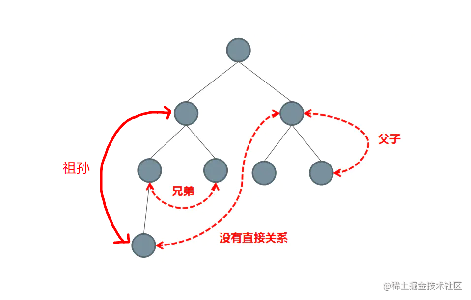
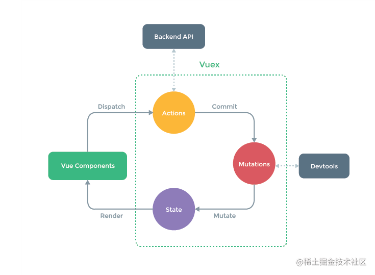

## 一、什么是组件通信
在开始之前我们需要明白什么是组件通信，**组件通信**可以拆分为两个部分：
* 组件
* 通信

都知道组件是`vue`最强大的功能之一，`vue`中每一个`.vue`文件我们都可以视之为一个组件，简单来说组件就是对UI结构的复用。

通信指的是发送者通过某种媒体以某种格式来传递信息到收信者以达到某个目的。广义上，任何信息的交通都是通信。而**组件间通信**即指组件(`.vue`)通过某种方式来传递信息以达到某个目的，举个栗子我们在使用`UI`框架中的`table`组件，可能会往`table`组件中传入某些数据，这个本质就形成了组件之间的通信。

## 二、为什么要进行组件通信
通信的本质是信息同步，共享。回到vue中，每个组件之间的都有独自的作用域，组件间的数据是无法共享的但实际开发工作中我们常常需要让组件之间共享数据，这也是组件通信的目的要让它们互相之间能进行通讯，这样才能实现数据间的交互，完成某种功能的开发。

## 三、组件通信的分类
组件间通信的分类可以分成以下

-   父子组件之间的通信
-   兄弟组件之间的通信
-   祖孙与后代组件之间的通信
-   非关系组件间之间的通信

他们之间的关系如下图：



## 四、组件间通信的八中方案
整理`vue`中8种常规的通信方案

1.  通过 `props` 传递
2.  通过 `emit` 触发自定义事件
3.  使用 `ref`
4.  事件总线 `EventBus`
6.  `attrs`
7.  依赖注入：`Provide` 与 `Inject`
8.  双向绑定：`v-model`
9.  全局状态管理：`Vuex`

### 1. defineProps 父传子
**使用场景**：父组件传递给子组件
-   子组件设置`props`属性，定义接收父组件传递过来的参数
-   父组件在使用子组件标签中通过字面量来传递值

`Children.vue`，子组件定义props，接收父组件传递过来的数据

```js
const props = defineProps:{  
  // 字符串形式  
  name: String // 接收的类型参数  
  // 对象形式  
  age:{    
    type:Number, // 接收的类型为数值  
    defaule:18,  // 默认值为18  
    require:true // age属性必须传递  
  }  
}  
```
`Father.vue`，父组件以属性值的方式向子组件传递数据
```html
<Children name="jack" :age=18 />
```

### 2. defineEmits 子传父
**适用场景**：子组件传递数据给父组件
-   子组件通过`defineEmits`触发自定义事件，`emit`第二个参数为传递的数值
-   父组件绑定监听器获取到子组件传递过来的参数

`Children.vue` 中
```js
// 定义自定义事件
const emit = defineEmits(['emit1'])

// 使用事件
const handleClick = () =>{
    emit('emit1', {name: 'CoderBin'})
}
```
`Father.vue`
```js
<Children @emit1="handleEmit1"/>

const handleEmit1 = (data) => {
    console.log(data.name) // CoderBin
}
```

### 3. ref/defineExpose 使用
-   父组件在使用子组件的时候设置`ref`
-   父组件通过设置子组件`ref`来获取数据

`Children`组件中，将需要被父组件使用的变量或方法暴露出去
```js
const name = ref("CoderBin")

const handleClick = () => {
    console.log("CoderBin)
}

defineExpose({name, handleClick})
```
`father.vue`中
```js
<Children ref="childrenRef"/>

// 定义 ref
const childrenRef = ref(null)

console.log(children.value.name) // 可以使用子组件中暴露的变量和方法
```

### 4. 事件总线 EventBus
**使用场景**：兄弟组件传值

我们创建一个 `Bus.js` 文件，用来控制数据和注册事件的。

`Bus.js` 里有一个 `Bus` 类

-   `eventList` 是必须项，用来存放事件列表的。
-   `constructor` 里除了 `eventList` 外，其他都是自定义数据，公共数据就是存在这里的。
-   `$on` 方法用来注册事件。
-   `$emit` 方法可以调用 `$on` 里的事件。
-   `$off` 方法可以注销 `eventList` 里的事件。

然后需要用到总线的组件，都导入 `Bus.js` ，就可以共同操作一份数据了。

`Bus.js`
```js
import { ref } from 'vue'

class Bus {
  constructor() {
    // 收集订阅信息,调度中心
	this.eventList = {}, // 事件列表，这项是必须的
    // 下面的都是自定义值
	this.msg = ref('这是一条总线的信息')
  }

  // 订阅
  $on(name, fn) {
	this.eventList[name] = this.eventList[name] || []
	this.eventList[name].push(fn)
  }

  // 发布
  $emit(name, data) {
	if (this.eventList[name]) {
      this.eventList[name].forEach((fn) => {
        fn(data)
      });
	}
  }

  // 取消订阅
  $off(name) {
      if (this.eventList[name]) {
	  delete this.eventList[name]
	}
  }
}

export default new Bus()
```
**父组件**
```html
// Parent.vue

<template>
  <div>
    父组件: 
    <span style="margin-right: 30px;">message: {{ message }}</span>
    <span>msg: {{ msg }}</span>
  </div>
  <Child></Child>
</template>

<script setup>
import { ref } from 'vue'
import Bus from './Bus.js'
import Child from './components/Child.vue'

const msg = ref(Bus.msg)

const message = ref('hello')

// 用监听的写法
Bus.$on('changeMsg', data => {
  message.value = data
})

</script>
```
**子组件**
```html
// Child.vue

<template>
  <div>
    子组件：
    <button @click="handleBusEmit">触发Bus.$emit</button>
    <button @click="changeBusMsg">修改总线里的 msg</button>
  </div>
</template>

<script setup>
import Bus from '../Bus.js'

function handleBusEmit() {
  Bus.$emit('changeMsg', '雷猴啊')
}

function changeBusMsg() {
  // console.log(Bus.msg)
  Bus.msg.value = '在子组件里修改了总线的值'
}
</script>
```

### 5 attrs 的使用
attrs:包含父作用域除class和style除外的非props属性集合

**父组件**
```html
<template>
  <child :msg1="msg1" :msg2="msg2" title="3333"></child>
</template>

<script setup>
  import child from './child.vue'
  import { ref,reactive } from 'vue'
 
  const msg1 = ref('111')
  const msg2 = ref('222')
</script>
```
**子组件**
```html
<script setup>
  import { defineProps,useContext,useAttars } from 'vue'

  const props = defineProps({
      msg1: String
  })

// 方法1

const ctx = useContext()
console.log(ctx.attars) // {msg2:'222',title:'333'}

// 方法2 
const attrs = useAttars()
console.log(attars)  // {msg2:'2222',title:'3333'}
</script>
```

### 6 provide/inject 依赖注入
**适用场景**：父（祖）组件给后代组件传值，如果传的是函数，后代组件还能通过参数的形式将数据传给父组件

**父（祖）组件**
```html
<script setup>
import { ref, provide } from 'vue'

const name = ref('CoderBin')

const handleClick = (data) => {
  // 接收子组件传递过来的参数
  console.log(data)
}

provide('pname', name.value)  // 传递变量
provide('phandleClick', handleClick)  // 传递方法
</script>
```
**后代组件**
```html
<script setup>
import { inject } from "vue"

// 接收数据
const name = inject('pname')

const handleClick = inject('phandleClick')
// 调用父组件传递过来的函数，并传了个参数回去
handleClick('test')
</script>

```

### 7. v-model
`v-model` 是 `Vue` 的一个语法糖。在 `Vue3` 中的玩法就更多(晕)了。

[官方文档 v-model](https://cn.vuejs.org/api/built-in-directives.html#v-model)

**父组件**
```html
// Parent.vue

<template>
  <Child v-model="message" />
</template>

<script setup>
import { ref } from 'vue'
import Child from './components/Child.vue'

const message = ref('test')
</script>
```

**子组件**

```html
// Child.vue

<template>
  <div @click="handleClick">{{modelValue}}</div>
</template>

<script setup>
import { ref } from 'vue'

// 接收
const props = defineProps([
   // 接收父组件使用 v-model 传进来的值，必须用 modelValue 这个名字来接收
  'modelValue'
])

// 必须用 update:modelValue 这个名字来通知父组件修改值
const emit = defineEmits(['update:modelValue']) 

function handleClick() {
  // 参数1：通知父组件修改值的方法名
  // 参数2：要修改的值
  emit('update:modelValue', 'CoderBin')
}

</script>
```

### 8. 全局状态管理：vuex
**适用场景**: 复杂关系的组件数据传递，Vuex作用相当于一个用来存储共享变量的容器，详细使用可前往

【1】Vuex: [全面拥抱Vue3，Vuex4 最新详解教程！](https://juejin.cn/post/7128715500988661773)

【2】Pinia(vuex5): [新一代的状态管理器？关于 Pinia 的全方位解析！](https://juejin.cn/post/7129127868935700510)



简单介绍：

* `state`用来存放共享变量的地方
* `getter`，可以增加一个`getter`派生状态，(相当于`store`中的计算属性），用来获得共享变量的值
* `mutations`用来存放修改`state`的方法。
* `actions`也是用来存放修改state的方法，不过`action`是在`mutations`的基础上进行。常用来做一些异步操作

## 5. 小结
* 父子关系的组件数据传递选择 `props`  与 `$emit`进行传递，也可选择`ref`
* 兄弟关系的组件数据传递可选择`$bus`，其次可以选择进行传递
* 祖先与后代组件数据传递可选择`Provide`与 `Inject`
* 复杂关系的组件数据传递可以通过`vuex`存放共享的变量


> 每文一句：时间，就像海绵里的水，只要愿挤，总是有的。——鲁迅
