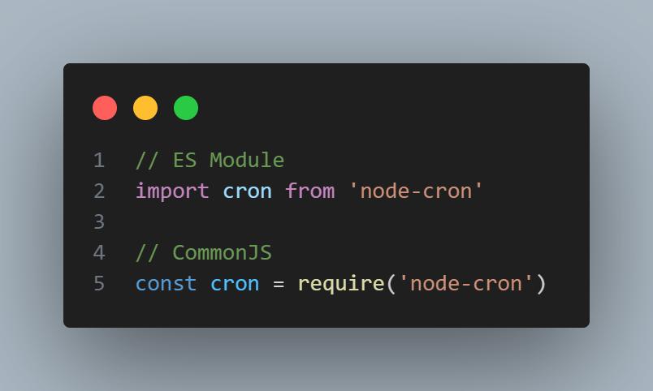
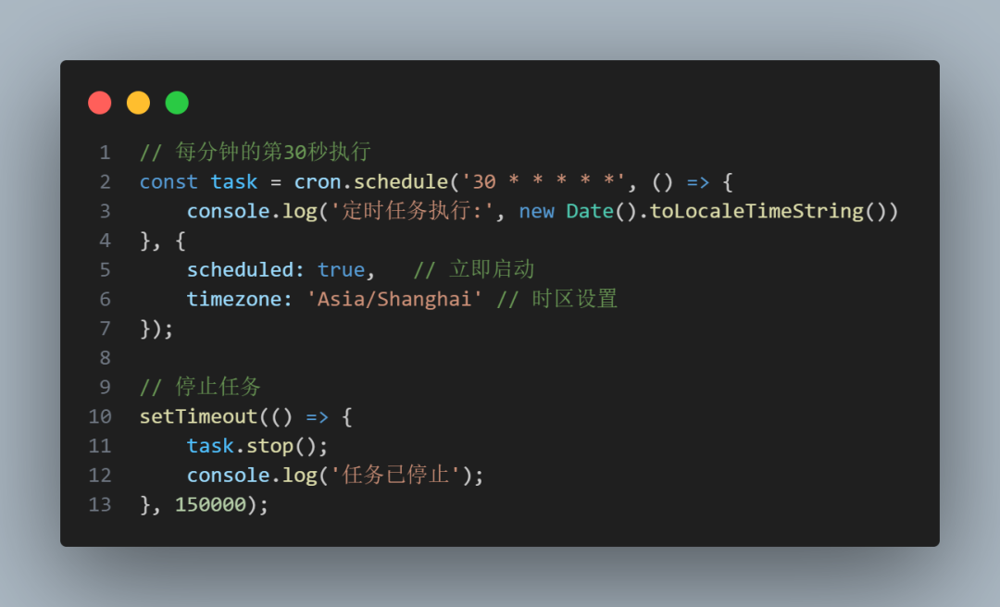
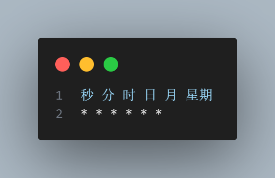
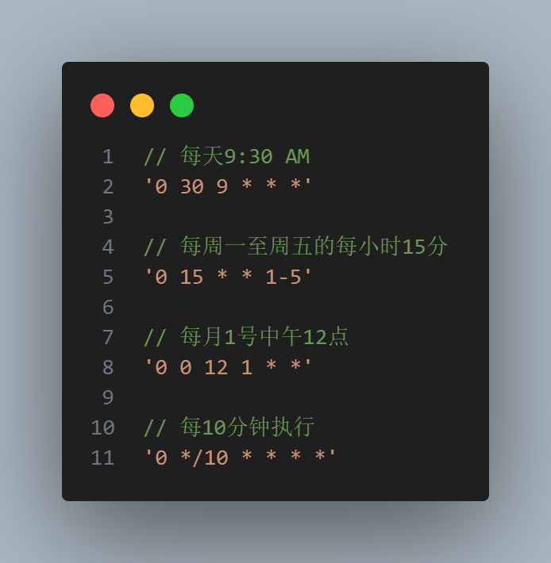
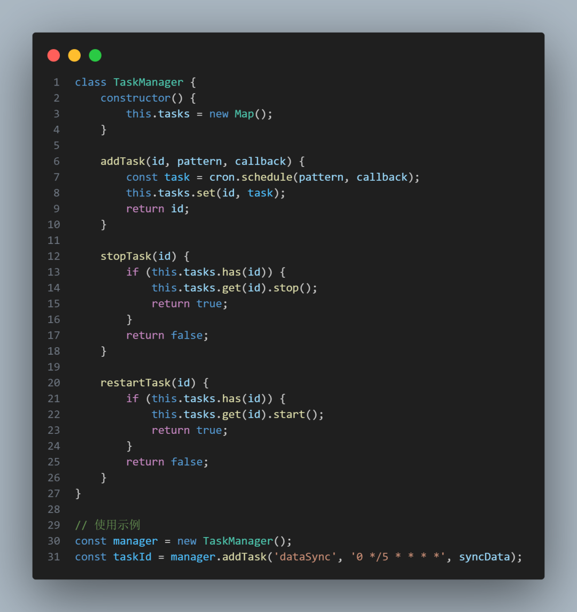
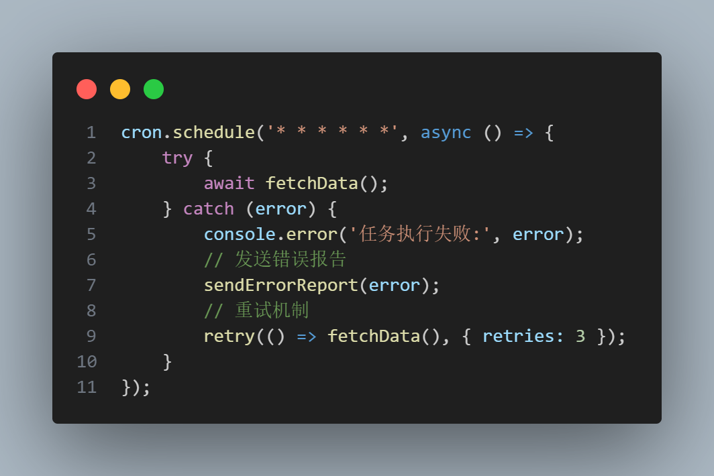
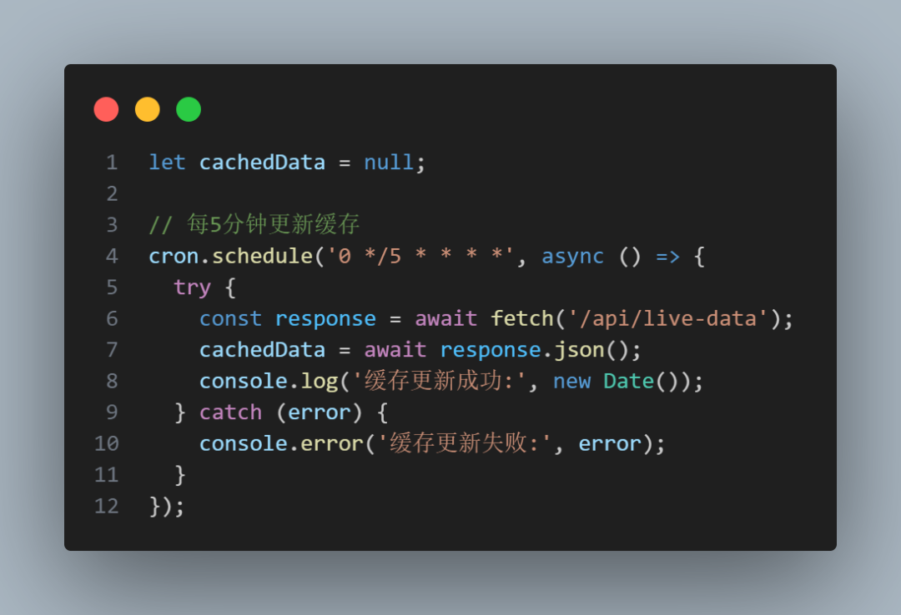
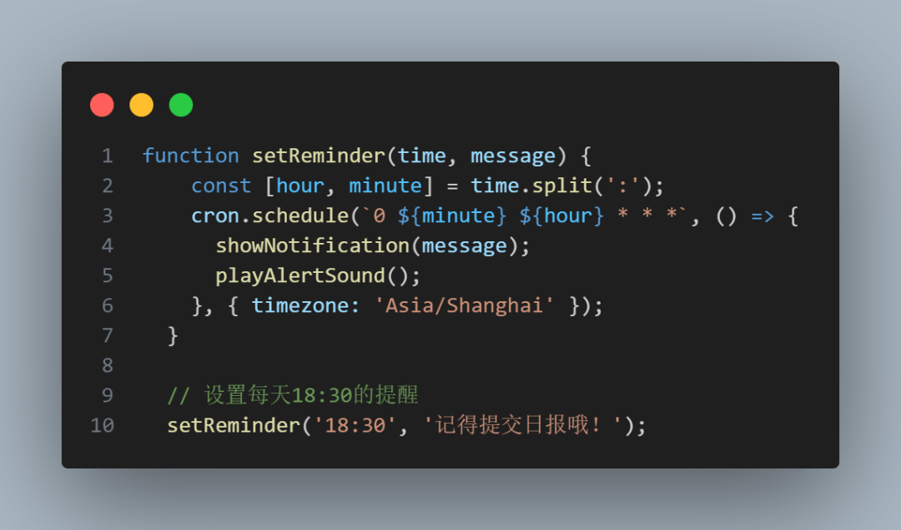
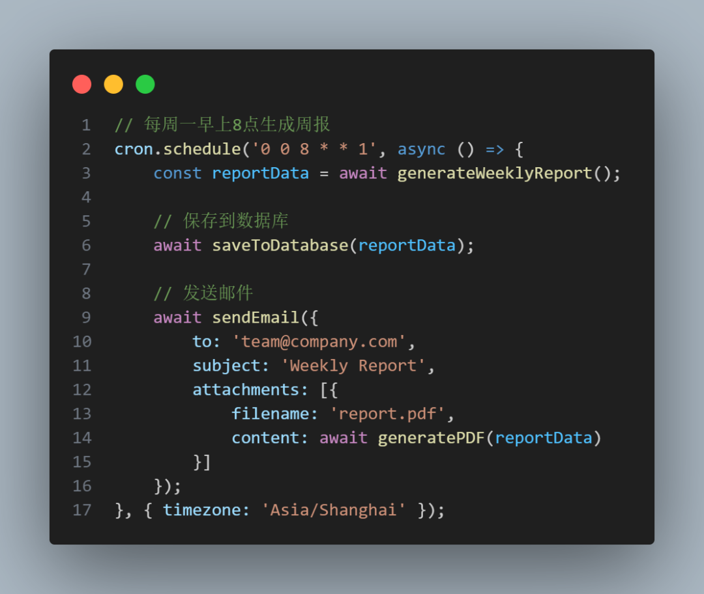

原文链接：<a href="https://mp.weixin.qq.com/s/x75dqt6FDHk5OEv13tr_tw" target="_black">前端定时任务的神库！快把它加到你的项目中去！</a>
#### 前言
作为前端工程师，我们常会遇到 `定时刷新数据、轮询接口、发送提醒` 等场景

#### 一、为什么选择cron库？
**定时任务开发痛点**

1、原生setInterval的时间误差累积

2、难以实现复杂的时间规则（如每月最后一天）

3、缺乏任务生命周期管理

**cron库优势**

1、**精准调度**：基于Cron表达式的时间控制

2、**丰富功能**：支持时区、任务启停、错误处理

3、**跨平台**：Node.js和浏览器环境通用

#### 二、快速入门

**安装与引入**
```shell
npm install node-cron
```



**第一个定时任务**



#### 三、Cron表达式详解
**标准格式**



**常用模式示例**



**常用模式示例**

1、*：任意值

2、,：值列表（5,10,15）

3、-：范围（1-5）

4、/：步长（*/5）

#### 三、进阶使用技巧
**动态任务管理**



**错误处理**



#### 四、典型应用场景

**数据轮询与缓存更新**



**定时提醒功能**



**自动化报表生成**



