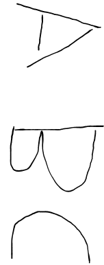

今日在开发中遇到一个问题，需要将图片进行旋转，使用 Canvas 进行处理。

原图片为：



转换方法如下：

```tsx
/**
 * 创建离屏 Canvas 处理旋转
 * @param srcDataURL 
 * @returns 
 */
const rotateCanvas = (srcDataURL: string): Promise<{ dataURL: string; blob: Blob }> => {
  return new Promise((resolve) => {
    const img = new Image();
    img.src = srcDataURL;
    
    img.onload = () => {
      const canvas = document.createElement('canvas');
      const ctx = canvas.getContext('2d');
      
      // 旋转后尺寸交换
      canvas.width = img.height;  // 原始高度变为新宽度
      canvas.height = img.width;  // 原始宽度变为新高度
      
      // 执行旋转绘制
      ctx.translate(canvas.width / 2, canvas.height / 2);
      ctx.rotate(-(90 * Math.PI) / 180); // 逆时针旋转90度
      ctx.drawImage(img, -img.width / 2, -img.height / 2);
      
      // 生成结果
      canvas.toBlob((rotatedBlob) => {
        resolve({
          dataURL: canvas.toDataURL(),
          blob: rotatedBlob,
        });
      }, 'image/png');
    };
  });
};
```
使用：
```tsx
// 执行旋转并更新状态
const { dataURL: rotatedDataURL, blob: rotatedBlob } = await rotateCanvas(dataURL);
```

最终效果：
